# Identity Provider CORS Discovery Specification

## Overview

This specification defines the **Traefik-Integrated CORS Discovery System** for the VF Services Identity Provider. The system automatically configures Cross-Origin Resource Sharing (CORS) policies based on the deployment environment and service discovery through Traefik reverse proxy integration.

### What is CORS?

Cross-Origin Resource Sharing (CORS) is a security feature implemented by web browsers that restricts web pages from making requests to a different domain than the one serving the web page. This is known as the "same-origin policy." CORS provides a way for servers to explicitly allow certain cross-origin requests while maintaining security.

### Why Do We Need Automated CORS Discovery?

In a microservices architecture with multiple services running behind Traefik, manually configuring CORS for each service can be:
- **Error-prone**: Manually maintaining origin lists across environments
- **Time-consuming**: Updating configurations for each deployment
- **Inconsistent**: Different CORS rules across services leading to integration issues

Our automated system solves these problems by:
- **Dynamic Discovery**: Automatically detecting services and their origins from Traefik configuration
- **Environment-Aware**: Applying different security levels based on deployment environment
- **Centralized Management**: Single configuration point for all CORS policies

## Table of Contents

- [Architecture](#architecture)
- [Environment Configuration](#environment-configuration)
- [Discovery Methods](#discovery-methods)
- [CORS Policy Rules](#cors-policy-rules)
- [Implementation Requirements](#implementation-requirements)
- [Configuration Variables](#configuration-variables)
- [Security Considerations](#security-considerations)
- [Testing Specification](#testing-specification)
- [Troubleshooting](#troubleshooting)

## Architecture

### System Components

The CORS Discovery System consists of several interconnected components that work together to provide automated CORS configuration:

1. **Client Layer**: The frontend applications (browsers, API clients, Swagger UI) that initiate cross-origin requests
2. **Infrastructure Layer**: Traefik reverse proxy and Docker networking that handle request routing
3. **Application Layer**: The microservices (Identity Provider, Website, Billing, Inventory) that serve the requests
4. **Discovery Layer**: The CORS discovery engine that automatically configures policies


### Discovery Flow Sequence

The discovery process follows a specific sequence to ensure reliable CORS configuration:

1. **Container Startup**: When the Identity Provider container starts, it initializes the CORS discovery system
2. **Environment Detection**: The system determines whether it's running in production, staging, or development
3. **Service Discovery**: The system attempts to discover services through multiple methods (Traefik variables, service labels, fallback)
4. **Rule Generation**: Based on discovered services and environment, appropriate CORS rules are generated
5. **Configuration Application**: The generated rules are applied to Django's CORS middleware


### Environment-Based Configuration Flow


## Environment Configuration

### Environment Types

| Environment | Security Level | HTTPS Required | Localhost Allowed | Wildcard Domains |
|-------------|----------------|----------------|-------------------|------------------|
| `production` | High | ✅ | ❌ | ✅ |
| `staging` | Medium | Optional | ❌ | ✅ |
| `development` | Low | Optional | ✅ | ✅ |

### Environment Detection Priority


### Practical Implementation Example

Here's how the CORS discovery system is implemented in the Identity Provider:

```python
# identity_app/cors_discovery.py
import os
import re
import logging
from typing import List, Dict, Optional
from django.conf import settings

logger = logging.getLogger(__name__)

class TraefikIntegratedCORS:
    """
    Traefik-integrated CORS discovery system for automatic origin configuration.
    
    This class automatically discovers services and their origins from Traefik
    configuration and applies appropriate CORS policies based on the environment.
    """
    
    def __init__(self):
        self.base_domain = os.getenv('BASE_DOMAIN', 'vfservices.viloforge.com')
        self.environment = self._detect_environment()
        self.services = []
        self.origins = []
        self.regexes = []
        
    def _detect_environment(self) -> str:
        """Detect the current environment with fallback logic."""
        # Priority 1: Explicit ENVIRONMENT variable
        env = os.getenv('ENVIRONMENT', '').lower()
        if env in ['production', 'staging', 'development']:
            return env
            
        # Priority 2: Django DEBUG setting
        if getattr(settings, 'DEBUG', False):
            return 'development'
            
        # Priority 3: Default to development
        return 'development'
    
    def discover_configuration(self) -> Dict:
        """
        Main discovery method that tries multiple strategies.
        
        Returns:
            Dict: Configuration dictionary with origins and regexes
        """
        logger.info(f"Starting CORS discovery for environment: {self.environment}")
        
        # Try discovery methods in order of preference
        if self._discover_from_traefik_env():
            logger.info("Successfully discovered configuration from Traefik environment variables")
        elif self._discover_from_service_labels():
            logger.info("Successfully discovered configuration from service labels")
        else:
            logger.warning("Using fallback configuration - no automatic discovery succeeded")
            self._use_fallback_config()
        
        self._build_cors_rules()
        
        return {
            'origins': self.origins,
            'regexes': self.regexes,
            'environment': self.environment,
            'base_domain': self.base_domain,
            'services': self.services
        }
    
    def _discover_from_traefik_env(self) -> bool:
        """
        Discover services from Traefik environment variables.
        
        Looks for variables like:
        TRAEFIK_HTTP_ROUTERS_IDENTITY_RULE=Host(`identity.vfservices.viloforge.com`)
        """
        traefik_vars = {k: v for k, v in os.environ.items() 
                       if k.startswith('TRAEFIK_HTTP_ROUTERS_') and k.endswith('_RULE')}
        
        if not traefik_vars:
            return False
        
        services = []
        for var_name, rule in traefik_vars.items():
            # Extract service name from variable name
            # TRAEFIK_HTTP_ROUTERS_IDENTITY_RULE -> identity
            service_name = var_name.split('_')[3].lower()
            
            # Extract domain from Host() rule
            host_match = re.search(r'Host\(`([^`]+)`\)', rule)
            if host_match:
                domain = host_match.group(1)
                services.append(service_name)
                logger.debug(f"Discovered service: {service_name} -> {domain}")
        
        if services:
            self.services = services
            return True
        
        return False
    
    def _build_cors_rules(self):
        """Build CORS origins and regex patterns based on discovered services."""
        # Base patterns for discovered services
        for service in self.services:
            service_domain = f"{service}.{self.base_domain}"
            
            if self.environment == 'production':
                # Production: HTTPS only
                self.origins.append(f"https://{service_domain}")
            else:
                # Staging/Development: HTTP and HTTPS
                self.origins.extend([
                    f"https://{service_domain}",
                    f"http://{service_domain}"
                ])
        
        # Add wildcard patterns for subdomains
        if self.environment == 'production':
            self.regexes.append(rf"^https://[\w\-]+\.{re.escape(self.base_domain)}$")
        else:
            self.regexes.append(rf"^https?://[\w\-]+\.{re.escape(self.base_domain)}$")
        
        # Development: Add localhost support
        if self.environment == 'development':
            local_origins = os.getenv('LOCAL_CORS_ORIGINS', 'http://localhost:3000,http://localhost:8080')
            self.origins.extend([origin.strip() for origin in local_origins.split(',')])
            
            # Localhost regex pattern
            self.regexes.append(r"^https?://localhost:\d+$")
            self.regexes.append(r"^https?://127\.0\.0\.1:\d+$")

# Django settings integration
def configure_cors():
    """Configure Django CORS settings using the discovery system."""
    discovery = TraefikIntegratedCORS()
    config = discovery.discover_configuration()
    
    # Apply to Django settings
    settings.CORS_ALLOWED_ORIGINS = config['origins']
    settings.CORS_ALLOWED_ORIGIN_REGEXES = config['regexes']
    
    # Environment-specific settings
    if config['environment'] == 'development':
        settings.CORS_ALLOW_CREDENTIALS = True
        settings.CORS_ALLOW_ALL_ORIGINS = os.getenv('CORS_ALLOW_ALL_ORIGINS_DEBUG', 'false').lower() == 'true'
    
    logger.info(f"CORS configured for {config['environment']} environment")
    logger.debug(f"Allowed origins: {config['origins']}")
    logger.debug(f"Regex patterns: {config['regexes']}")
    
    return config
```

### Django Settings Integration

```python
# identity_app/settings.py
import os
from .cors_discovery import configure_cors

# Configure CORS automatically
cors_config = configure_cors()

# Additional CORS settings
CORS_ALLOW_HEADERS = [
    'accept',
    'accept-encoding',
    'authorization',
    'content-type',
    'dnt',
    'origin',
    'user-agent',
    'x-csrftoken',
    'x-requested-with',
]

CORS_ALLOW_METHODS = [
    'DELETE',
    'GET',
    'OPTIONS',
    'PATCH',
    'POST',
    'PUT',
]

# Preflight cache time (in seconds)
CORS_PREFLIGHT_MAX_AGE = 86400  # 24 hours
```

### Environment Configuration Examples

#### Production Environment
```bash
# Environment variables for production
ENVIRONMENT=production
BASE_DOMAIN=vfservices.viloforge.com
TRAEFIK_HTTP_ROUTERS_IDENTITY_RULE=Host(`identity.vfservices.viloforge.com`)
TRAEFIK_HTTP_ROUTERS_WEBSITE_RULE=Host(`www.vfservices.viloforge.com`)
TRAEFIK_HTTP_ROUTERS_API_RULE=Host(`api.vfservices.viloforge.com`)

# Resulting CORS configuration:
# CORS_ALLOWED_ORIGINS = [
#     "https://identity.vfservices.viloforge.com",
#     "https://www.vfservices.viloforge.com", 
#     "https://api.vfservices.viloforge.com"
# ]
# CORS_ALLOWED_ORIGIN_REGEXES = [
#     r"^https://[\w\-]+\.vfservices\.viloforge\.com$"
# ]
```

#### Development Environment
```bash
# Environment variables for development
ENVIRONMENT=development
BASE_DOMAIN=vfservices.viloforge.com
LOCAL_CORS_ORIGINS=http://localhost:3000,http://localhost:8080,http://127.0.0.1:3000
CORS_ALLOW_ALL_ORIGINS_DEBUG=false

# Resulting CORS configuration:
# CORS_ALLOWED_ORIGINS = [
#     "https://identity.vfservices.viloforge.com",
#     "http://identity.vfservices.viloforge.com",
#     "http://localhost:3000",
#     "http://localhost:8080",
#     "http://127.0.0.1:3000"
# ]
# CORS_ALLOWED_ORIGIN_REGEXES = [
#     r"^https?://[\w\-]+\.vfservices\.viloforge\.com$",
#     r"^https?://localhost:\d+$",
#     r"^https?://127\.0\.0\.1:\d+$"
# ]
```

## Discovery Methods

### Discovery Method Priority


### Traefik Environment Variable Discovery

```mermaid
flowchart LR
    subgraph "Environment Variables"
        Env1[TRAEFIK_HTTP_ROUTERS_IDENTITY_RULE]
        Env2[TRAEFIK_HTTP_ROUTERS_WEBSITE_RULE]
        Env3[TRAEFIK_HTTP_ROUTERS_API_RULE]
    end
    
    subgraph "Discovery Process"
        Scan[Scan TRAEFIK_* Variables]
        Extract[Extract Host() Rules]
        Parse[Parse Domains]
        Build[Build Service List]
    end
    
    subgraph "Output"
        Domain[Base Domain:<br/>vfservices.viloforge.com]
        Services[Services:<br/>identity, website, api]
    end
    
    Env1 --> Scan
    Env2 --> Scan
    Env3 --> Scan
    
    Scan --> Extract
    Extract --> Parse
    Parse --> Build
    
    Build --> Domain
    Build --> Services
```

## CORS Policy Rules

### Understanding CORS Policy Rules

CORS policy rules determine which cross-origin requests are allowed based on the request's origin. Our system applies different rules depending on the environment to balance security and development convenience.

#### Rule Components

1. **Origin Validation**: Exact match against allowed origins list
2. **Regex Patterns**: Pattern matching for wildcard domains  
3. **Protocol Enforcement**: HTTP/HTTPS requirements based on environment
4. **Localhost Support**: Development-only localhost access

#### Security Considerations by Environment

- **Production**: Maximum security with HTTPS-only access and no localhost
- **Staging**: Medium security allowing HTTP for testing but no localhost  
- **Development**: Relaxed security with localhost access for local development

### Environment-Specific CORS Rules

```mermaid
graph TB
    subgraph "Production Environment"
        ProdInput[Request Origin] --> ProdCheck{HTTPS + Domain Match?}
        ProdCheck -->|✅ Yes| ProdAllow[Allow Request]
        ProdCheck -->|❌ No| ProdDeny[Deny Request]
        
        ProdExamples["Examples:<br/>✅ https://api.vfservices.viloforge.com<br/>❌ http://api.vfservices.viloforge.com<br/>❌ https://evil.com<br/>❌ http://localhost:8000"]
    end
    
    subgraph "Staging Environment"
        StageInput[Request Origin] --> StageCheck{HTTP/HTTPS + Domain Match?}
        StageCheck -->|✅ Yes| StageAllow[Allow Request]
        StageCheck -->|❌ No| StageDeny[Deny Request]
        
        StageExamples["Examples:<br/>✅ https://api.vfservices.viloforge.com<br/>✅ http://api.vfservices.viloforge.com<br/>❌ https://evil.com<br/>❌ http://localhost:8000"]
    end
    
    subgraph "Development Environment"
        DevInput[Request Origin] --> DevCheck{Domain Match OR Localhost?}
        DevCheck -->|✅ Yes| DevAllow[Allow Request]
        DevCheck -->|❌ No| DevDeny[Deny Request]
        
        DevExamples["Examples:<br/>✅ https://api.vfservices.viloforge.com<br/>✅ http://api.vfservices.viloforge.com<br/>✅ http://localhost:8000<br/>❌ https://evil.com"]
    end
    
    style ProdAllow fill:#c8e6c9
    style StageAllow fill:#c8e6c9
    style DevAllow fill:#c8e6c9
    style ProdDeny fill:#ffcdd2
    style StageDeny fill:#ffcdd2
    style DevDeny fill:#ffcdd2
```



### CORS Validation Flow


### Practical CORS Testing Examples

#### Testing CORS with curl

```bash
# Test a valid origin (should succeed)
curl -H "Origin: https://www.vfservices.viloforge.com" \
     -H "Access-Control-Request-Method: POST" \
     -H "Access-Control-Request-Headers: X-Requested-With" \
     -X OPTIONS \
     https://identity.vfservices.viloforge.com/api/auth/login/

# Expected response headers:
# Access-Control-Allow-Origin: https://www.vfservices.viloforge.com
# Access-Control-Allow-Methods: POST, GET, OPTIONS, PUT, DELETE, PATCH
# Access-Control-Allow-Headers: X-Requested-With, Content-Type, Authorization
# Access-Control-Max-Age: 86400

# Test an invalid origin (should fail)
curl -H "Origin: https://malicious.com" \
     -H "Access-Control-Request-Method: POST" \
     -X OPTIONS \
     https://identity.vfservices.viloforge.com/api/auth/login/

# Expected response: 403 Forbidden or no CORS headers
```

#### JavaScript Testing Examples

```javascript
// Frontend code example - Valid cross-origin request
async function loginUser(credentials) {
    try {
        const response = await fetch('https://identity.vfservices.viloforge.com/api/auth/login/', {
            method: 'POST',
            headers: {
                'Content-Type': 'application/json',
                'X-Requested-With': 'XMLHttpRequest'
            },
            credentials: 'include', // Include cookies for authentication
            body: JSON.stringify(credentials)
        });
        
        if (!response.ok) {
            throw new Error(`HTTP error! status: ${response.status}`);
        }
        
        return await response.json();
    } catch (error) {
        if (error.name === 'TypeError' && error.message.includes('CORS')) {
            console.error('CORS error - origin not allowed:', window.location.origin);
        }
        throw error;
    }
}

// Usage from allowed origin
// This would work when called from https://www.vfservices.viloforge.com
loginUser({ username: 'user', password: 'pass' })
    .then(data => console.log('Login successful:', data))
    .catch(error => console.error('Login failed:', error));
```

#### Browser Network Tab Analysis

When debugging CORS issues, look for these patterns in the browser's Network tab:

1. **Successful CORS Request**:
   ```
   Request URL: https://identity.vfservices.viloforge.com/api/auth/login/
   Request Method: OPTIONS (preflight)
   Status Code: 200 OK
   
   Response Headers:
   Access-Control-Allow-Origin: https://www.vfservices.viloforge.com
   Access-Control-Allow-Methods: POST, GET, OPTIONS, PUT, DELETE, PATCH
   Access-Control-Allow-Headers: Content-Type, Authorization
   ```

2. **Failed CORS Request**:
   ```
   Request URL: https://identity.vfservices.viloforge.com/api/auth/login/
   Request Method: OPTIONS (preflight)
   Status Code: 403 Forbidden
   
   Console Error:
   Access to fetch at 'https://identity.vfservices.viloforge.com/api/auth/login/' 
   from origin 'https://malicious.com' has been blocked by CORS policy
   ```

## Implementation Requirements

### Overview

The CORS discovery system is implemented as a Django application component that integrates with the existing Identity Provider. It consists of several key classes and functions that work together to provide automated CORS configuration.

### Core Components Architecture

```mermaid
classDiagram
    class TraefikIntegratedCORS {
        -base_domain: str
        -services: List[str]
        -origins: List[str]
        -regexes: List[str]
        -environment: str
        +discover_configuration() Dict
        -_discover_from_traefik_env() bool
        -_discover_from_service_labels() bool
        -_use_fallback_config() void
        -_build_cors_rules() void
    }
    
    class CORSConfig {
        +origins: List[str]
        +regexes: List[str]
        +base_domain: str
        +services: List[str]
        +environment: str
        +validate_origin(origin: str) bool
    }
    
    class EnvironmentDetector {
        +detect_environment() str
        +is_production() bool
        +is_development() bool
        +is_staging() bool
    }
    
    class ServiceDiscovery {
        +discover_from_traefik() List[str]
        +discover_from_labels() List[str]
        +get_base_domain() str
    }
    
    TraefikIntegratedCORS --> CORSConfig
    TraefikIntegratedCORS --> EnvironmentDetector
    TraefikIntegratedCORS --> ServiceDiscovery
    
    CORSConfig --> "Django CORS Middleware"
```

### Django Integration Flow


## Configuration Variables

### Environment Variable Reference

The CORS discovery system relies on several environment variables to configure its behavior. These variables are categorized by their importance and source.

#### Required Variables

| Variable | Description | Example | Impact |
|----------|-------------|---------|---------|
| `ENVIRONMENT` | Deployment environment | `production`, `staging`, `development` | Determines security level and CORS rules |
| `BASE_DOMAIN` | Base domain for all services | `vfservices.viloforge.com` | Used to generate allowed origins |

#### Optional Variables  

| Variable | Description | Default | Example |
|----------|-------------|---------|---------|
| `PEER_SERVICES` | Comma-separated list of service names | Auto-discovered | `identity,website,billing,inventory` |
| `LOCAL_CORS_ORIGINS` | Development localhost origins | `http://localhost:3000,http://localhost:8080` | `http://localhost:3000,http://127.0.0.1:8080` |
| `CORS_ALLOW_ALL_ORIGINS_DEBUG` | Allow all origins in debug mode | `false` | `true` (use with caution) |
| `TRAEFIK_API_URL` | Traefik API endpoint for service discovery | `http://traefik:8080` | `http://traefik:8080/api/v1` |

#### Traefik-Injected Variables

These variables are automatically injected by Traefik when containers start:

| Variable Pattern | Description | Example |
|------------------|-------------|---------|
| `TRAEFIK_HTTP_ROUTERS_*_RULE` | Host routing rules | `TRAEFIK_HTTP_ROUTERS_IDENTITY_RULE=Host(\`identity.vfservices.viloforge.com\`)` |
| `TRAEFIK_HTTP_ROUTERS_*_ENTRYPOINTS` | Entry points configuration | `TRAEFIK_HTTP_ROUTERS_IDENTITY_ENTRYPOINTS=web,websecure` |

### Configuration Examples

#### Docker Compose Configuration

```yaml
# docker-compose.yml
version: '3.8'

services:
  identity-provider:
    build: ./identity-provider
    environment:
      # Required CORS configuration
      ENVIRONMENT: ${ENVIRONMENT:-development}
      BASE_DOMAIN: ${BASE_DOMAIN:-vfservices.viloforge.com}
      
      # Optional CORS configuration  
      LOCAL_CORS_ORIGINS: "http://localhost:3000,http://localhost:8080,http://127.0.0.1:3000"
      CORS_ALLOW_ALL_ORIGINS_DEBUG: "false"
      
      # Database and other settings
      DATABASE_URL: postgresql://user:pass@db:5432/identity
      SECRET_KEY: ${SECRET_KEY}
      DEBUG: ${DEBUG:-false}
      
    labels:
      # Traefik configuration
      - "traefik.enable=true"
      - "traefik.http.routers.identity.rule=Host(`identity.${BASE_DOMAIN:-vfservices.viloforge.com}`)"
      - "traefik.http.routers.identity.entrypoints=web,websecure"
      - "traefik.http.routers.identity.tls=true"
      - "traefik.http.routers.identity.tls.certresolver=letsencrypt"
    
  website:
    build: ./website
    environment:
      ENVIRONMENT: ${ENVIRONMENT:-development}
      BASE_DOMAIN: ${BASE_DOMAIN:-vfservices.viloforge.com}
    labels:
      - "traefik.enable=true"
      - "traefik.http.routers.website.rule=Host(`www.${BASE_DOMAIN:-vfservices.viloforge.com}`)"
      - "traefik.http.routers.website.entrypoints=web,websecure"
```

#### Environment-Specific .env Files

```bash
# .env.production
ENVIRONMENT=production
BASE_DOMAIN=vfservices.viloforge.com
DEBUG=false
CORS_ALLOW_ALL_ORIGINS_DEBUG=false

# .env.staging  
ENVIRONMENT=staging
BASE_DOMAIN=staging.vfservices.viloforge.com
DEBUG=false
CORS_ALLOW_ALL_ORIGINS_DEBUG=false

# .env.development
ENVIRONMENT=development
BASE_DOMAIN=dev.vfservices.viloforge.com
DEBUG=true
LOCAL_CORS_ORIGINS=http://localhost:3000,http://localhost:8080,http://127.0.0.1:3000,http://127.0.0.1:8080
CORS_ALLOW_ALL_ORIGINS_DEBUG=false
```

### Environment Variable Dependencies

```mermaid
graph TB
    subgraph "Required Variables"
        Env1[ENVIRONMENT<br/>production|staging|development]
        Env2[BASE_DOMAIN<br/>vfservices.viloforge.com]
    end
    
    subgraph "Optional Variables"
        Env3[PEER_SERVICES<br/>comma-separated list]
        Env4[LOCAL_CORS_ORIGINS<br/>localhost origins]
        Env5[CORS_ALLOW_ALL_ORIGINS_DEBUG<br/>true|false]
        Env6[TRAEFIK_API_URL<br/>http://traefik:8080]
    end
    
    subgraph "Traefik-Injected Variables"
        Traefik1[TRAEFIK_HTTP_ROUTERS_*_RULE]
        Traefik2[TRAEFIK_HTTP_ROUTERS_*_ENTRYPOINTS]
    end
    
    subgraph "Discovery Engine"
        Discovery[CORS Discovery Engine]
    end
    
    Env1 --> Discovery
    Env2 --> Discovery
    Env3 --> Discovery
    Env4 --> Discovery
    Env5 --> Discovery
    Env6 --> Discovery
    
    Traefik1 --> Discovery
    Traefik2 --> Discovery
    
    style Env1 fill:#ffcdd2
    style Env2 fill:#ffcdd2
    style Discovery fill:#e1f5fe
```

## Security Considerations

### Security Level Comparison

```mermaid
graph TB
    subgraph "Production Security"
        ProdHTTPS[HTTPS Only ✅]
        ProdDomain[Domain Restricted ✅]
        ProdLocal[No Localhost ❌]
        ProdWild[Wildcard Domains ✅]
        
        ProdLevel[Security Level: HIGH 🔒🔒🔒]
    end
    
    subgraph "Staging Security"
        StageHTTPS[HTTPS + HTTP ⚠️]
        StageDomain[Domain Restricted ✅]
        StageLocal[No Localhost ❌]
        StageWild[Wildcard Domains ✅]
        
        StageLevel[Security Level: MEDIUM 🔒🔒]
    end
    
    subgraph "Development Security"
        DevHTTPS[HTTPS + HTTP ⚠️]
        DevDomain[Domain Restricted ✅]
        DevLocal[Localhost Allowed ⚠️]
        DevWild[Wildcard Domains ✅]
        
        DevLevel[Security Level: LOW 🔒]
    end
    
    style ProdLevel fill:#c8e6c9
    style StageLevel fill:#fff3e0
    style DevLevel fill:#ffcdd2
```



### Threat Model


## Testing Specification

### Testing Strategy Overview

Comprehensive testing of the CORS discovery system requires multiple layers of testing to ensure reliability across different environments and scenarios. Our testing strategy covers unit tests, integration tests, end-to-end tests, and security validation.

### Test Categories

1. **Unit Tests**: Test individual components in isolation
2. **Integration Tests**: Test component interactions and Django integration  
3. **End-to-End Tests**: Test complete CORS flows with real browsers
4. **Security Tests**: Validate security controls and threat mitigation

### Test Coverage Strategy


### Test Execution Flow


### Practical Testing Examples

#### Unit Test Examples

```python
# tests/test_cors_discovery.py
import os
import pytest
from unittest.mock import patch, Mock
from django.test import TestCase
from identity_app.cors_discovery import TraefikIntegratedCORS

class TestTraefikIntegratedCORS(TestCase):
    
    def setUp(self):
        self.cors = TraefikIntegratedCORS()
    
    def test_environment_detection_explicit(self):
        """Test environment detection with explicit ENVIRONMENT variable."""
        with patch.dict(os.environ, {'ENVIRONMENT': 'production'}):
            cors = TraefikIntegratedCORS()
            self.assertEqual(cors.environment, 'production')
    
    def test_environment_detection_debug_fallback(self):
        """Test environment detection falling back to DEBUG setting."""
        with patch.dict(os.environ, {}, clear=True):
            with patch('django.conf.settings.DEBUG', True):
                cors = TraefikIntegratedCORS()
                self.assertEqual(cors.environment, 'development')
    
    def test_traefik_discovery_success(self):
        """Test successful Traefik variable discovery."""
        env_vars = {
            'TRAEFIK_HTTP_ROUTERS_IDENTITY_RULE': 'Host(`identity.vfservices.viloforge.com`)',
            'TRAEFIK_HTTP_ROUTERS_WEBSITE_RULE': 'Host(`www.vfservices.viloforge.com`)',
            'BASE_DOMAIN': 'vfservices.viloforge.com'
        }
        
        with patch.dict(os.environ, env_vars):
            cors = TraefikIntegratedCORS()
            result = cors._discover_from_traefik_env()
            
            self.assertTrue(result)
            self.assertIn('identity', cors.services)
            self.assertIn('website', cors.services)
    
    def test_cors_rules_production(self):
        """Test CORS rule generation for production environment."""
        with patch.dict(os.environ, {'ENVIRONMENT': 'production'}):
            cors = TraefikIntegratedCORS()
            cors.services = ['identity', 'website']
            cors._build_cors_rules()
            
            # Should only include HTTPS origins
            self.assertIn('https://identity.vfservices.viloforge.com', cors.origins)
            self.assertNotIn('http://identity.vfservices.viloforge.com', cors.origins)
            self.assertNotIn('http://localhost:3000', cors.origins)
    
    def test_cors_rules_development(self):
        """Test CORS rule generation for development environment."""
        with patch.dict(os.environ, {
            'ENVIRONMENT': 'development',
            'LOCAL_CORS_ORIGINS': 'http://localhost:3000,http://localhost:8080'
        }):
            cors = TraefikIntegratedCORS()
            cors.services = ['identity']
            cors._build_cors_rules()
            
            # Should include both HTTP and HTTPS, plus localhost
            self.assertIn('https://identity.vfservices.viloforge.com', cors.origins)
            self.assertIn('http://identity.vfservices.viloforge.com', cors.origins)
            self.assertIn('http://localhost:3000', cors.origins)
```

#### Integration Test Examples

```python
# tests/test_cors_integration.py
from django.test import TestCase, Client
from django.test.utils import override_settings
from unittest.mock import patch
import json

class CORSIntegrationTest(TestCase):
    
    def setUp(self):
        self.client = Client()
    
    @override_settings(
        CORS_ALLOWED_ORIGINS=['https://www.vfservices.viloforge.com'],
        CORS_ALLOWED_ORIGIN_REGEXES=[r'^https://[\w\-]+\.vfservices\.viloforge\.com$']
    )
    def test_cors_allowed_origin(self):
        """Test that allowed origins receive proper CORS headers."""
        response = self.client.options(
            '/api/auth/login/',
            HTTP_ORIGIN='https://www.vfservices.viloforge.com',
            HTTP_ACCESS_CONTROL_REQUEST_METHOD='POST'
        )
        
        self.assertEqual(response.status_code, 200)
        self.assertEqual(
            response['Access-Control-Allow-Origin'],
            'https://www.vfservices.viloforge.com'
        )
        self.assertIn('POST', response['Access-Control-Allow-Methods'])
    
    @override_settings(
        CORS_ALLOWED_ORIGINS=['https://www.vfservices.viloforge.com']
    )
    def test_cors_denied_origin(self):
        """Test that disallowed origins are rejected."""
        response = self.client.options(
            '/api/auth/login/',
            HTTP_ORIGIN='https://malicious.com',
            HTTP_ACCESS_CONTROL_REQUEST_METHOD='POST'
        )
        
        # Should not have CORS headers
        self.assertNotIn('Access-Control-Allow-Origin', response)
    
    def test_cors_regex_pattern_match(self):
        """Test that regex patterns work correctly."""
        with patch('identity_app.cors_discovery.configure_cors') as mock_configure:
            mock_configure.return_value = {
                'origins': [],
                'regexes': [r'^https://[\w\-]+\.vfservices\.viloforge\.com$'],
                'environment': 'production'
            }
            
            response = self.client.options(
                '/api/auth/login/',
                HTTP_ORIGIN='https://api.vfservices.viloforge.com',
                HTTP_ACCESS_CONTROL_REQUEST_METHOD='GET'
            )
            
            self.assertEqual(response.status_code, 200)
            self.assertEqual(
                response['Access-Control-Allow-Origin'],
                'https://api.vfservices.viloforge.com'
            )
```

#### End-to-End Test Examples

```python
# tests/test_cors_e2e.py
import pytest
from selenium import webdriver
from selenium.webdriver.common.by import By
from selenium.webdriver.support.ui import WebDriverWait
from selenium.webdriver.support import expected_conditions as EC
import time

class TestCORSEndToEnd:
    
    @pytest.fixture
    def driver(self):
        options = webdriver.ChromeOptions()
        options.add_argument('--headless')
        options.add_argument('--disable-web-security')  # For testing purposes only
        driver = webdriver.Chrome(options=options)
        yield driver
        driver.quit()
    
    def test_cors_from_allowed_origin(self, driver):
        """Test CORS requests from an allowed origin work correctly."""
        # Navigate to allowed origin
        driver.get('https://www.vfservices.viloforge.com/test-page')
        
        # Execute JavaScript that makes CORS request
        script = """
        return fetch('https://identity.vfservices.viloforge.com/api/health/', {
            method: 'GET',
            headers: {
                'Content-Type': 'application/json'
            }
        })
        .then(response => response.json())
        .then(data => ({ success: true, data: data }))
        .catch(error => ({ success: false, error: error.toString() }));
        """
        
        result = driver.execute_async_script("""
        var callback = arguments[arguments.length - 1];
        """ + script + """.then(callback);
        """)
        
        assert result['success'] == True
        assert 'data' in result
    
    def test_cors_from_disallowed_origin_blocked(self, driver):
        """Test that CORS requests from disallowed origins are blocked."""
        # This would need to be run from a different domain
        # Implementation depends on test setup
        pass
```

#### Security Test Examples

```python
# tests/test_cors_security.py
from django.test import TestCase, Client
from django.test.utils import override_settings

class CORSSecurityTest(TestCase):
    
    def setUp(self):
        self.client = Client()
    
    def test_malicious_origin_blocked(self):
        """Test that malicious origins are blocked."""
        malicious_origins = [
            'https://evil.com',
            'https://vfservices.viloforge.com.evil.com',  # Subdomain hijack attempt
            'https://vfservices-viloforge.com',  # Typosquatting
            'javascript:alert(1)',  # XSS attempt
            'data:text/html,<script>alert(1)</script>',  # Data URI attempt
        ]
        
        for origin in malicious_origins:
            with self.subTest(origin=origin):
                response = self.client.options(
                    '/api/auth/login/',
                    HTTP_ORIGIN=origin,
                    HTTP_ACCESS_CONTROL_REQUEST_METHOD='POST'
                )
                
                # Should not have CORS headers
                self.assertNotIn('Access-Control-Allow-Origin', response)
    
    @override_settings(
        CORS_ALLOWED_ORIGINS=['https://www.vfservices.viloforge.com']
    )
    def test_https_enforcement_production(self):
        """Test that production environment enforces HTTPS."""
        with patch.dict(os.environ, {'ENVIRONMENT': 'production'}):
            # HTTP origin should be blocked in production
            response = self.client.options(
                '/api/auth/login/',
                HTTP_ORIGIN='http://www.vfservices.viloforge.com',
                HTTP_ACCESS_CONTROL_REQUEST_METHOD='POST'
            )
            
            self.assertNotIn('Access-Control-Allow-Origin', response)
    
    def test_localhost_blocked_production(self):
        """Test that localhost is blocked in production environment."""
        with patch.dict(os.environ, {'ENVIRONMENT': 'production'}):
            response = self.client.options(
                '/api/auth/login/',
                HTTP_ORIGIN='http://localhost:3000',
                HTTP_ACCESS_CONTROL_REQUEST_METHOD='POST'
            )
            
            self.assertNotIn('Access-Control-Allow-Origin', response)
```

#### Running Tests

```bash
# Run all CORS tests
python manage.py test tests.test_cors_discovery tests.test_cors_integration tests.test_cors_security

# Run with coverage
coverage run --source='.' manage.py test tests.test_cors_*
coverage report --include="identity_app/cors_discovery.py"

# Run specific test categories
python manage.py test tests.test_cors_discovery  # Unit tests only
python manage.py test tests.test_cors_integration  # Integration tests only

# Run with verbose output
python manage.py test tests.test_cors_* --verbosity=2
```

## Troubleshooting

### Common CORS Issues and Solutions

CORS issues can be complex to debug because they involve interaction between the browser, server, and network infrastructure. This section provides systematic approaches to identify and resolve common problems.

### Issue Categories

1. **Discovery Failures**: The system cannot discover services or configuration
2. **Request Blocking**: Valid requests are being blocked by CORS policies  
3. **Environment Issues**: Wrong environment detection or configuration
4. **Performance Issues**: Slow discovery or high resource usage

### Diagnostic Flow


### Common Issue Resolution

```mermaid
graph TB
    subgraph "Issue Categories"
        I1[Discovery Failures]
        I2[CORS Blocks]
        I3[Environment Issues]
        I4[Performance Issues]
    end
    
    subgraph "Diagnostic Commands"
        D1[docker exec app env | grep TRAEFIK]
        D2[curl -I -H Origin: test.com /api/]
        D3[docker logs app | grep CORS]
        D4[docker stats app]
    end
    
    subgraph "Solutions"
        S1[Fix Traefik Labels]
        S2[Update CORS Rules]
        S3[Set Environment Variables]
        S4[Optimize Discovery]
    end
    
    I1 --> D1
    I2 --> D2
    I3 --> D3
    I4 --> D4
    
    D1 --> S1
    D2 --> S2
    D3 --> S3
    D4 --> S4
    
    style I1 fill:#ffcdd2
    style S1 fill:#c8e6c9
```

### Practical Troubleshooting Guide

#### 1. Discovery Failures

**Symptoms:**
- CORS discovery falls back to default configuration
- Services not being discovered automatically
- Log messages indicating discovery failure

**Diagnostic Steps:**

```bash
# Check if Traefik environment variables are present
docker exec identity-provider env | grep TRAEFIK

# Expected output should include:
# TRAEFIK_HTTP_ROUTERS_IDENTITY_RULE=Host(`identity.vfservices.viloforge.com`)
# TRAEFIK_HTTP_ROUTERS_WEBSITE_RULE=Host(`www.vfservices.viloforge.com`)

# Check container labels
docker inspect identity-provider | jq '.[0].Config.Labels'

# Check Django logs for discovery messages
docker logs identity-provider | grep -i cors

# Test discovery manually in Django shell
docker exec -it identity-provider python manage.py shell
>>> from identity_app.cors_discovery import TraefikIntegratedCORS
>>> cors = TraefikIntegratedCORS()
>>> config = cors.discover_configuration()
>>> print(config)
```

**Common Solutions:**

```yaml
# Fix missing Traefik labels in docker-compose.yml
services:
  identity-provider:
    labels:
      - "traefik.enable=true"
      - "traefik.http.routers.identity.rule=Host(`identity.${BASE_DOMAIN}`)"
      - "traefik.http.routers.identity.entrypoints=web,websecure"

# Ensure BASE_DOMAIN is set correctly
environment:
  BASE_DOMAIN: vfservices.viloforge.com
```

#### 2. CORS Request Blocking

**Symptoms:**
- Browser console shows CORS errors
- API requests failing with CORS policy violations
- OPTIONS preflight requests returning 403/404

**Diagnostic Steps:**

```bash
# Test CORS headers manually
curl -I -H "Origin: https://www.vfservices.viloforge.com" \
     -H "Access-Control-Request-Method: POST" \
     -X OPTIONS \
     https://identity.vfservices.viloforge.com/api/auth/login/

# Check current CORS configuration
docker exec -it identity-provider python manage.py shell
>>> from django.conf import settings
>>> print("CORS_ALLOWED_ORIGINS:", settings.CORS_ALLOWED_ORIGINS)
>>> print("CORS_ALLOWED_ORIGIN_REGEXES:", settings.CORS_ALLOWED_ORIGIN_REGEXES)

# Verify environment detection
>>> import os
>>> print("ENVIRONMENT:", os.getenv('ENVIRONMENT'))
>>> print("BASE_DOMAIN:", os.getenv('BASE_DOMAIN'))
```

**Browser Debugging:**

```javascript
// In browser console, check request details
fetch('https://identity.vfservices.viloforge.com/api/health/')
  .then(response => {
    console.log('Response headers:', [...response.headers.entries()]);
    return response.json();
  })
  .catch(error => {
    console.error('CORS Error:', error);
    console.log('Current origin:', window.location.origin);
  });
```

**Common Solutions:**

```python
# Temporarily enable debug mode to allow all origins (DEVELOPMENT ONLY)
# In .env file:
CORS_ALLOW_ALL_ORIGINS_DEBUG=true
ENVIRONMENT=development

# Add specific origins manually if discovery fails
# In Django settings:
CORS_ALLOWED_ORIGINS = [
    "https://www.vfservices.viloforge.com",
    "https://identity.vfservices.viloforge.com",
    "http://localhost:3000",  # Development only
]
```

#### 3. Environment Issues

**Symptoms:**
- Wrong security level being applied
- Localhost blocked when it should be allowed
- HTTPS not enforced in production

**Diagnostic Steps:**

```bash
# Check environment detection
docker exec identity-provider env | grep -E "(ENVIRONMENT|DEBUG)"

# Verify environment-specific behavior
docker exec -it identity-provider python manage.py shell
>>> from identity_app.cors_discovery import TraefikIntegratedCORS
>>> cors = TraefikIntegratedCORS()
>>> print(f"Detected environment: {cors.environment}")
>>> print(f"Origins: {cors.origins}")
>>> print(f"Regexes: {cors.regexes}")
```

**Common Solutions:**

```bash
# Set environment explicitly
# In docker-compose.yml or .env:
ENVIRONMENT=production  # or staging, development

# For development, ensure DEBUG is set
DEBUG=true

# For production, ensure HTTPS enforcement
ENVIRONMENT=production
# This will automatically exclude HTTP origins and localhost
```

#### 4. Performance Issues

**Symptoms:**
- Slow application startup
- High memory usage during discovery
- Frequent discovery timeouts

**Diagnostic Steps:**

```bash
# Monitor resource usage during startup
docker stats identity-provider

# Check discovery timing
docker logs identity-provider | grep -i "cors discovery" | tail -20

# Profile Django startup
docker exec -it identity-provider python -c "
import time
start = time.time()
from identity_app.cors_discovery import configure_cors
config = configure_cors()
print(f'Discovery took: {time.time() - start:.2f} seconds')
"
```

**Common Solutions:**

```python
# Add caching to discovery results
import functools
import time

@functools.lru_cache(maxsize=1)
def cached_discover_configuration(self):
    return self._discover_configuration_impl()

# Set discovery timeout
TRAEFIK_DISCOVERY_TIMEOUT = 5  # seconds

# Use fallback configuration for faster startup
CORS_USE_FALLBACK_CONFIG = True  # Skip discovery entirely
```

#### 5. Docker Network Issues

**Symptoms:**
- Services can't communicate internally
- External CORS works but internal requests fail

**Diagnostic Steps:**

```bash
# Check Docker network connectivity
docker network ls
docker network inspect vfservices_default

# Test internal service communication
docker exec identity-provider curl -I http://website:8000/health/
docker exec website curl -I http://identity-provider:8000/api/health/
```

**Common Solutions:**

```yaml
# Ensure services are on the same network
networks:
  default:
    name: vfservices_default

# Add internal origins for service-to-service communication
environment:
  INTERNAL_CORS_ORIGINS: "http://website:8000,http://billing-api:8000"
```

## Performance Considerations

### Performance Metrics

```mermaid
graph TB
    subgraph "Initialization Performance"
        Init1[Discovery Time: ~50-100ms]
        Init2[Memory Usage: ~1MB]
        Init3[CPU Impact: Minimal]
    end
    
    subgraph "Runtime Performance"
        Run1[Regex Matching: O(1)]
        Run2[Memory Usage: ~10KB]
        Run3[Network Impact: None]
    end
    
    subgraph "Optimization Strategies"
        Opt1[Cache Discovery Results]
        Opt2[Lazy Loading]
        Opt3[Fallback Timeout]
    end
    
    Init1 --> Opt2
    Init2 --> Opt1
    Run1 --> Opt3
    
    style Init1 fill:#e3f2fd
    style Run1 fill:#e8f5e8
    style Opt1 fill:#fff3e0
```

## Future Enhancements

### Roadmap


---

## Conclusion

### Summary

The Traefik-Integrated CORS Discovery System provides a robust, automated solution for managing CORS policies in the VF Services microservices architecture. By integrating with Traefik's service discovery capabilities, the system eliminates manual CORS configuration while maintaining security best practices across different deployment environments.

### Key Benefits

1. **Automated Configuration**: No manual CORS setup required - the system automatically discovers services and configures appropriate policies
2. **Environment-Aware Security**: Different security levels (production, staging, development) ensure appropriate protection without hindering development
3. **Maintenance-Free Operation**: As services are added or removed, CORS policies are automatically updated
4. **Consistent Behavior**: Unified CORS handling across all microservices reduces integration complexity
5. **Comprehensive Testing**: Multiple layers of testing ensure reliability and security

### Implementation Checklist

When implementing the CORS discovery system, ensure:

- [ ] **Environment Variables**: Set `ENVIRONMENT` and `BASE_DOMAIN` correctly
- [ ] **Traefik Labels**: Configure proper Traefik routing labels for all services
- [ ] **Django Integration**: Import and configure the CORS discovery in Django settings
- [ ] **Testing**: Run comprehensive test suite covering unit, integration, and security tests
- [ ] **Monitoring**: Set up logging and monitoring for CORS discovery operations
- [ ] **Documentation**: Update deployment documentation with environment-specific configurations

### Best Practices

1. **Always Test CORS Changes**: Use the provided test suites before deploying to production
2. **Monitor Discovery Logs**: Watch for discovery failures and fallback configurations
3. **Environment Separation**: Never use development CORS settings in production
4. **Regular Security Reviews**: Periodically audit allowed origins and regex patterns
5. **Performance Monitoring**: Track discovery timing and resource usage

### Migration Guide

For existing services, migrate to the CORS discovery system gradually:

1. **Phase 1**: Deploy discovery system alongside existing manual CORS configuration  
2. **Phase 2**: Test discovery system with staging environment
3. **Phase 3**: Enable discovery system in production with manual fallback
4. **Phase 4**: Remove manual CORS configuration once discovery is proven stable

### Support and Maintenance

- **Logging**: All CORS operations are logged at appropriate levels for debugging
- **Fallback**: System gracefully falls back to safe defaults if discovery fails  
- **Updates**: System can be updated without service restart using configuration reload
- **Monitoring**: Integration points available for Prometheus and other monitoring systems

The CORS discovery system represents a significant advancement in microservices security automation, providing developers with a seamless experience while maintaining enterprise-grade security standards.

## Document Information

- **Version**: 1.0.0
- **Last Updated**: June 15, 2025
- **Author**: VF Services Development Team
- **Review Date**: December 15, 2025

## References

- [Mermaid Documentation](https://mermaid.js.org/)
- [Django CORS Headers Documentation](https://github.com/adamchainz/django-cors-headers)
- [Traefik Docker Provider](https://doc.traefik.io/traefik/providers/docker/)
- [CORS Specification (RFC 6454)](https://tools.ietf.org/html/rfc6454)
- [Django Settings Documentation](https://docs.djangoproject.com/en/stable/ref/settings/)