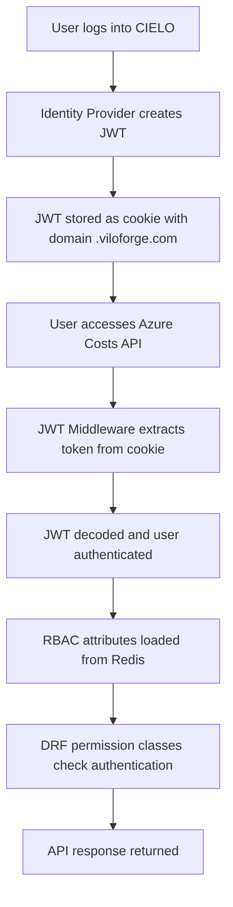

# JWT Authentication Implementation Guide

## Overview

This guide provides step-by-step instructions for implementing JWT authentication in new API services within the VF Services platform. Our authentication system enables cross-service authentication where users can log into one service (e.g., CIELO website) and access protected endpoints in other services (e.g., Azure Costs API) seamlessly.

## Architecture Overview



## Key Components

1. **Shared JWT Middleware** (`common/jwt_auth/middleware.py`) - Handles JWT token extraction and user creation
2. **RBAC System** (`common/rbac_abac/`) - Loads user roles and permissions
3. **Identity Provider** - Issues and validates JWT tokens
4. **Cookie Domain Sharing** - Enables cross-subdomain authentication

## Implementation Steps

### Step 1: Basic Django Setup

Create your Django project with the standard structure:

```
your-api/
├── main/
│   ├── __init__.py
│   ├── settings.py
│   ├── urls.py
│   └── wsgi.py
├── your_app/
│   ├── __init__.py
│   ├── apps.py
│   ├── views.py
│   └── urls.py
└── requirements.txt
```

### Step 2: Configure Dependencies

Add these to your `requirements.txt`:

```txt
Django>=4.2.0
djangorestframework>=3.14.0
django-cors-headers>=4.0.0
PyJWT>=2.8.0
redis>=4.5.0
```

### Step 3: Update settings.py

**File:** `your-api/main/settings.py`

```python
import os
import sys
from pathlib import Path

# Build paths
BASE_DIR = Path(__file__).resolve().parent.parent

# Add parent directory to Python path for shared common modules
sys.path.insert(0, str(BASE_DIR.parent))

# Security settings
SECRET_KEY = os.environ.get('SECRET_KEY', 'your-secret-key')
DEBUG = os.environ.get('DEBUG', 'True').lower() == 'true'

# Domain configuration
APPLICATION_SET_DOMAIN = os.environ.get("APPLICATION_SET_DOMAIN", "cielo")

ALLOWED_HOSTS = [
    f"your-api.{APPLICATION_SET_DOMAIN}",
    f".{APPLICATION_SET_DOMAIN}",
    "localhost",
    "127.0.0.1",
    "[::1]",
    "your-api"
]

# Applications
INSTALLED_APPS = [
    "django.contrib.admin",
    "django.contrib.auth",
    "django.contrib.contenttypes",
    "django.contrib.sessions",
    "django.contrib.messages",
    "django.contrib.staticfiles",
    "rest_framework",
    "corsheaders",
    "your_app",  # Your app name
]

# Middleware - ORDER IS CRITICAL
MIDDLEWARE = [
    "corsheaders.middleware.CorsMiddleware",
    "django.middleware.security.SecurityMiddleware",
    "django.contrib.sessions.middleware.SessionMiddleware",
    "django.middleware.common.CommonMiddleware",
    "django.middleware.csrf.CsrfViewMiddleware",
    "django.contrib.auth.middleware.AuthenticationMiddleware",
    "common.jwt_auth.middleware.JWTAuthenticationMiddleware",  # MUST be after AuthenticationMiddleware
    "django.contrib.messages.middleware.MessageMiddleware",
    "django.middleware.clickjacking.XFrameOptionsMiddleware",
]

# Database
DATABASES = {
    "default": {
        "ENGINE": "django.db.backends.postgresql",
        "NAME": os.environ.get("POSTGRES_DB", "your_api_db"),
        "USER": os.environ.get("POSTGRES_USER", "vfuser"),
        "PASSWORD": os.environ.get("POSTGRES_PASSWORD", "vfpass"),
        "HOST": os.environ.get("POSTGRES_HOST", "localhost"),
        "PORT": os.environ.get("POSTGRES_PORT", "5432"),
    }
}

# JWT Configuration
JWT_SECRET = os.environ.get("VF_JWT_SECRET", "change-me")
SSO_COOKIE_DOMAIN = os.environ.get("SSO_COOKIE_DOMAIN", "localhost")

# CORS Configuration for cross-service requests
CORS_ALLOWED_ORIGINS = [
    f"https://website.{APPLICATION_SET_DOMAIN}",
    f"https://cielo.{APPLICATION_SET_DOMAIN}",
    f"https://{APPLICATION_SET_DOMAIN}",
    "http://localhost:3000",  # Development
    "http://localhost:8080",  # Development
]

CORS_ALLOW_CREDENTIALS = True
CORS_ALLOW_HEADERS = [
    'accept',
    'accept-encoding',
    'authorization',
    'content-type',
    'dnt',
    'origin',
    'user-agent',
    'x-csrftoken',
    'x-requested-with',
]

# Redis configuration for RBAC
REDIS_HOST = os.environ.get('REDIS_HOST', 'localhost')
REDIS_PORT = int(os.environ.get('REDIS_PORT', 6379))

# Service name for RBAC (MUST match your service manifest)
SERVICE_NAME = 'your_service_name'

# RBAC Cache settings
RBAC_ABAC_CACHE_TTL = int(os.environ.get('RBAC_ABAC_CACHE_TTL', 86400))
IDENTITY_PROVIDER_URL = os.environ.get('IDENTITY_PROVIDER_URL', 'http://identity-provider:8000')

# ⚠️  IMPORTANT: DO NOT configure REST_FRAMEWORK authentication classes
# The JWT middleware handles authentication - DRF just needs to check the user
```

### Step 4: Create Service Manifest

**File:** `your-api/manifest.py`

```python
"""
Service manifest for RBAC-ABAC integration.
This defines the roles and permissions for your service.
"""

SERVICE_MANIFEST = {
    "service": "your_service_name",  # Must match SERVICE_NAME in settings
    "display_name": "Your Service Display Name",
    "description": "Description of what your service does",
    "roles": [
        {
            "name": "your_service_admin",
            "display_name": "Your Service Administrator",
            "description": "Full administrative access to your service",
            "permissions": ["*"]  # All permissions
        },
        {
            "name": "your_service_manager", 
            "display_name": "Your Service Manager",
            "description": "Management access to your service",
            "permissions": ["view", "edit", "export"]
        },
        {
            "name": "your_service_viewer",
            "display_name": "Your Service Viewer", 
            "description": "Read-only access to your service",
            "permissions": ["view"]
        }
    ],
    "attributes": [
        {
            "name": "department",
            "type": "string",
            "description": "User's department"
        },
        {
            "name": "customer_ids", 
            "type": "list",
            "description": "List of customer IDs user can access"
        }
    ],
    "endpoints": [
        {
            "path": "/api/private",
            "method": "GET",
            "required_roles": ["your_service_viewer", "your_service_manager", "your_service_admin"],
            "description": "Private endpoint requiring authentication"
        }
    ]
}
```

### Step 5: Update App Configuration

**File:** `your-api/your_app/apps.py`

```python
from django.apps import AppConfig
import logging

logger = logging.getLogger(__name__)

class YourAppConfig(AppConfig):
    default_auto_field = 'django.db.models.BigAutoField'
    name = 'your_app'

    def ready(self):
        """Register service with identity provider on startup."""
        try:
            from django.conf import settings
            
            # Skip registration in certain conditions
            if (hasattr(settings, 'SKIP_SERVICE_REGISTRATION') and 
                settings.SKIP_SERVICE_REGISTRATION):
                logger.info("Skipping service registration (SKIP_SERVICE_REGISTRATION=True)")
                return
                
            # Import and register
            from common.rbac_abac import register_service_on_startup
            register_service_on_startup()
            
        except ImportError as e:
            logger.warning(f"RBAC-ABAC module not available: {e}")
        except Exception as e:
            logger.error(f"Failed to register service: {e}")
```

### Step 6: Implement Views

**File:** `your-api/your_app/views.py`

```python
import logging
from django.utils import timezone
from rest_framework import status
from rest_framework.decorators import api_view, permission_classes
from rest_framework.permissions import AllowAny, IsAuthenticated
from rest_framework.response import Response

logger = logging.getLogger(__name__)

@api_view(['GET'])
@permission_classes([AllowAny])
def health(request):
    """Public health check endpoint."""
    return Response({
        "status": "healthy",
        "service": "your-api",
        "version": "1.0.0",
        "timestamp": timezone.now().isoformat()
    })

@api_view(['GET'])
@permission_classes([IsAuthenticated])  # ✅ This is all you need for JWT auth!
def private(request):
    """Private endpoint requiring JWT authentication."""
    user = request.user
    user_attrs = getattr(request, 'user_attrs', None)
    
    # Check user has required roles for your service
    if user_attrs:
        roles = getattr(user_attrs, 'roles', [])
    else:
        roles = []
    
    # Define which roles can access this endpoint
    allowed_roles = ['your_service_admin', 'your_service_manager', 'your_service_viewer']
    has_access = any(role in roles for role in allowed_roles)
    
    if not has_access:
        logger.warning(f"User {user.username} lacks required roles", extra={
            'user_id': user.id,
            'username': user.username,
            'roles': roles
        })
        return Response(
            {"detail": "You don't have permission to access this service"},
            status=status.HTTP_403_FORBIDDEN
        )
    
    # User is authenticated and authorized
    return Response({
        "message": "Your API - Private Endpoint",
        "service": "your_service",
        "user": {
            "id": user.id,
            "username": user.username,
            "email": getattr(user, 'email', None)
        },
        "roles": roles,
        "timestamp": timezone.now().isoformat()
    })

@api_view(['GET'])
@permission_classes([IsAuthenticated])
def admin_only(request):
    """Endpoint requiring admin role."""
    user_attrs = getattr(request, 'user_attrs', None)
    
    if user_attrs:
        roles = getattr(user_attrs, 'roles', [])
        if 'your_service_admin' not in roles:
            return Response(
                {"detail": "Admin access required"},
                status=status.HTTP_403_FORBIDDEN
            )
    else:
        return Response(
            {"detail": "No role information available"},
            status=status.HTTP_403_FORBIDDEN
        )
    
    return Response({
        "message": "Admin-only endpoint accessed successfully",
        "user": request.user.username
    })
```

### Step 7: Configure URLs

**File:** `your-api/your_app/urls.py`

```python
from django.urls import path
from . import views

urlpatterns = [
    path('health', views.health, name='health'),
    path('private', views.private, name='private'),
    path('admin-only', views.admin_only, name='admin_only'),
]
```

**File:** `your-api/main/urls.py`

```python
from django.contrib import admin
from django.urls import path, include

urlpatterns = [
    path('admin/', admin.site.urls),
    path('api/', include('your_app.urls')),
]
```

## Testing Your Implementation

### 1. Manual Testing

```bash
# Test without authentication (should fail)
curl https://your-api.your-domain.viloforge.com/api/private

# Test with JWT cookie (should succeed if user has roles)
curl -b "jwt=YOUR_JWT_TOKEN" https://your-api.your-domain.viloforge.com/api/private
```

### 2. Playwright Integration Tests

Create tests following the pattern in `playwright/cielo-website/integration-tests/test_azure_costs_access.py`:

```python
def test_cross_service_authentication():
    """Test that user can access your API after CIELO login"""
    with sync_playwright() as p:
        browser = p.chromium.launch(headless=True)
        context = browser.new_context(ignore_https_errors=True)
        page = context.new_page()
        
        # Login to CIELO
        page.goto("https://cielo.viloforge.com")
        # ... login steps ...
        
        # Access your API
        response = page.goto("https://your-api.cielo.viloforge.com/api/private")
        assert response.status == 200
```

## Common Patterns

### Accessing User Information

```python
def my_view(request):
    # Basic user info (always available for authenticated users)
    user_id = request.user.id
    username = request.user.username
    email = getattr(request.user, 'email', None)
    
    # RBAC attributes (may be None if not loaded)
    user_attrs = getattr(request, 'user_attrs', None)
    if user_attrs:
        roles = getattr(user_attrs, 'roles', [])
        department = getattr(user_attrs, 'department', None)
        customer_ids = getattr(user_attrs, 'customer_ids', [])
```

### Role-Based Access Control

```python
def check_user_role(request, required_roles):
    """Helper function to check if user has required roles."""
    user_attrs = getattr(request, 'user_attrs', None)
    if not user_attrs:
        return False
    
    user_roles = getattr(user_attrs, 'roles', [])
    return any(role in user_roles for role in required_roles)

@api_view(['GET'])
@permission_classes([IsAuthenticated])
def role_protected_view(request):
    if not check_user_role(request, ['admin', 'manager']):
        return Response(
            {"detail": "Insufficient permissions"}, 
            status=status.HTTP_403_FORBIDDEN
        )
    # ... rest of view
```

## Troubleshooting

### Authentication Not Working

1. **Check middleware order** - JWT middleware MUST be after `AuthenticationMiddleware`
2. **Verify SERVICE_NAME** - Must match your service manifest
3. **Check JWT_SECRET** - Must match identity provider's secret
4. **Domain configuration** - Ensure cookies can be shared across subdomains

### RBAC Attributes Not Loading

1. **Redis connection** - Verify Redis is accessible
2. **Service registration** - Check if service registered with identity provider
3. **User roles** - Verify user has been assigned roles for your service

### Common Mistakes

❌ **DON'T configure REST_FRAMEWORK authentication classes**
```python
# WRONG - This will override JWT middleware
REST_FRAMEWORK = {
    'DEFAULT_AUTHENTICATION_CLASSES': ['...'],
}
```

❌ **DON'T use manual authentication checks**
```python
# WRONG - DRF handles this automatically
@permission_classes([])
def my_view(request):
    if not request.user.is_authenticated:
        return Response({"error": "Not authenticated"})
```

✅ **DO use standard DRF patterns**
```python
# CORRECT - Simple and works perfectly
@permission_classes([IsAuthenticated])
def my_view(request):
    # User is guaranteed to be authenticated here
```

## Security Considerations

1. **JWT Secret** - Use strong, unique secrets in production
2. **HTTPS Only** - Always use HTTPS in production
3. **Cookie Security** - Configure secure, httpOnly cookies
4. **Role Validation** - Always validate user roles for sensitive operations
5. **Logging** - Log authentication attempts and role checks

## Deployment Checklist

- [ ] Environment variables configured (JWT_SECRET, DATABASE, REDIS)
- [ ] Service registered with identity provider
- [ ] User roles assigned in identity provider
- [ ] CORS origins configured correctly
- [ ] HTTPS certificates configured
- [ ] Health endpoint accessible
- [ ] Cross-service authentication tested
- [ ] Role-based access control tested

## References

- [Working Example: billing-api](../billing-api/)
- [Working Example: azure-costs](../azure-costs/)
- [RBAC-ABAC Documentation](../docs/RBAC-ABAC-IMPLEMENTATION.md)
- [Cross-Service Auth Analysis](../docs/CROSS-SERVICE-AUTH-ANALYSIS.md)