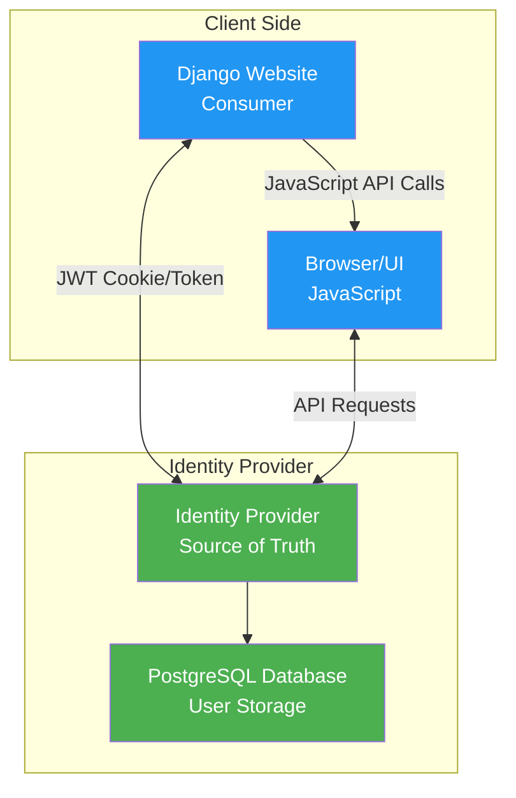
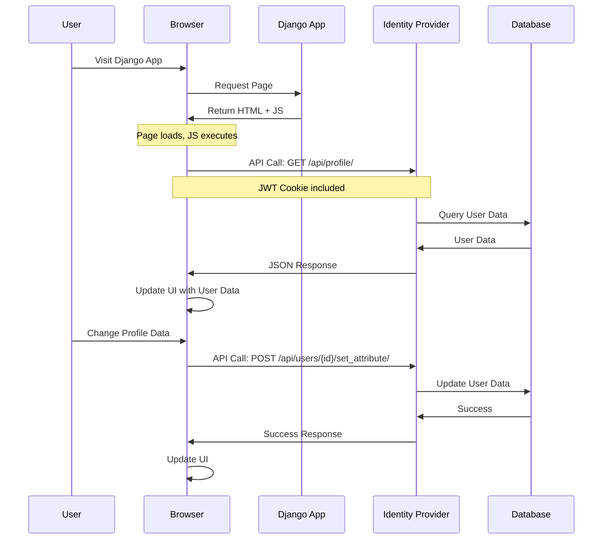
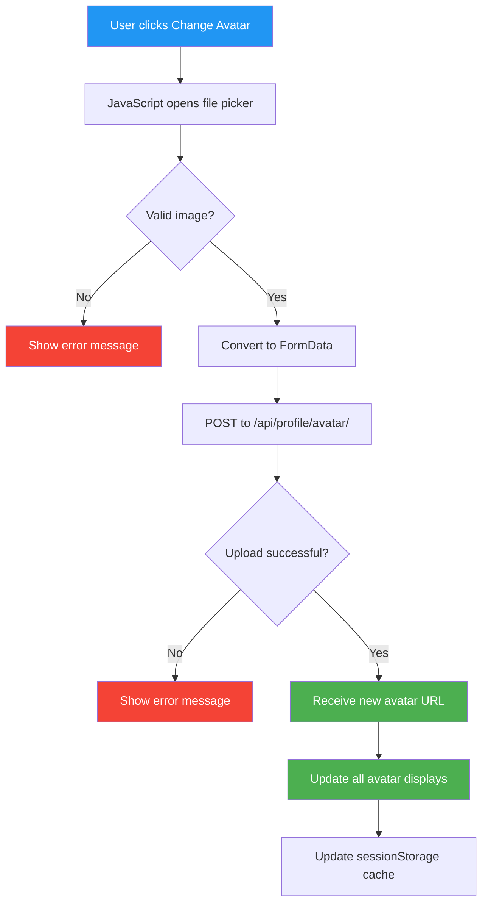

# User Management Architecture: Identity Provider as Single Source of Truth

## Overview

In the VFServices ecosystem, user management follows a centralized architecture where the **Identity Provider** serves as the single source of truth for all user-related data and operations. All Django applications (website, cielo-website, maltacentral-web, etc.) are **consumers** of the Identity Provider's API and do not manage user data directly.

## Architecture Principles

### 1. Centralized User Management
- **Identity Provider**: Owns and manages all user data, authentication, and authorization
- **Django Applications**: Act as stateless consumers that display user data via API calls
- **No Local User Storage**: Django apps do not store user data in their own databases
- **API-First Design**: All user interactions happen through the Identity Provider's REST API

### 2. Authentication Flow



### 3. Data Flow Pattern



## API Endpoints

The Identity Provider exposes these key endpoints for user management:

- `POST /api/login/` - Authenticate user and receive JWT token
- `POST /api/logout/` - Invalidate user session
- `GET /api/profile/` - Retrieve current user's profile data
- `GET /api/admin/users/` - List all users (admin only)
- `GET /api/admin/users/{id}/` - Get specific user details
- `POST /api/admin/users/{id}/set_attribute/` - Set user attributes
- `DELETE /api/admin/users/{id}/attributes/{name}/` - Remove user attributes

## JavaScript Integration Pattern

Django applications should follow this pattern for user data:

```javascript
// Example: Fetching user profile
async function loadUserProfile() {
    try {
        const response = await fetch('https://identity.vfservices.viloforge.com/api/profile/', {
            credentials: 'include',  // Include JWT cookie
            headers: {
                'Accept': 'application/json',
            }
        });
        
        if (response.ok) {
            const userData = await response.json();
            updateUIWithUserData(userData);
        }
    } catch (error) {
        console.error('Failed to load profile:', error);
    }
}

// Example: Updating user data
async function updateUserAttribute(name, value) {
    const response = await fetch(`https://identity.vfservices.viloforge.com/api/admin/users/${userId}/set_attribute/`, {
        method: 'POST',
        credentials: 'include',
        headers: {
            'Content-Type': 'application/json',
            'X-CSRFToken': getCsrfToken()
        },
        body: JSON.stringify({ name, value })
    });
    
    return response.ok;
}
```

## Use Case: User Avatar Management

### Current State (As of 2025-06-22)
- ✅ Avatar functionality is now implemented in the Identity Provider
- ✅ Avatar URLs are stored as UserAttributes in the Identity Provider
- ✅ The `/api/profile/` endpoint returns `avatar_url` field
- ✅ Django applications load avatars dynamically via JavaScript
- ✅ Fallback to numbered default avatars based on user ID
- ✅ Implemented in all Django projects: website, cielo-website, maltacentral-web

### Implementation Details

#### 1. Identity Provider Changes (Implemented)

**Avatar Storage**: Using UserAttribute model
```python
# Avatar URLs are stored as global UserAttributes
UserAttribute.objects.update_or_create(
    user=user,
    name='avatar_url',
    service=None,  # Global attribute
    defaults={
        'value': avatar_url,
        'updated_by': user
    }
)
```

**Profile Endpoint Response**: Enhanced `/api/profile/` endpoint
```json
{
    "id": 123,
    "username": "john_doe",
    "email": "john@example.com",
    "first_name": "John",
    "last_name": "Doe",
    "avatar_url": "https://identity.vfservices.viloforge.com/media/avatars/123_uuid.jpg",
    "roles": [
        {
            "role_name": "website_user",
            "service_name": "website",
            "is_active": true
        }
    ],
    "timestamp": "2025-06-22T10:00:00Z"
}
```

**Avatar Upload Endpoint**: New `POST /api/profile/avatar/` endpoint
- Accepts multipart/form-data with 'avatar' field
- Validates file type (JPEG, PNG, GIF, WebP)
- Enforces 5MB size limit
- Auto-resizes images larger than 800px
- Returns: `{"avatar_url": "https://..."}`

#### 2. Django Application Changes (Implemented)

**Template Changes**: Updated base.html
```html
<!-- In base.html - simplified avatar element -->

```

**JavaScript Integration**: Using avatar-management.js
```html
<!-- Avatar Management -->
<script src=""></script>
<script>
    // Initialize avatar loading
    document.addEventListener('DOMContentLoaded', function() {
        // Configure the avatar manager with correct identity provider URL
        AvatarManager.config.identityProviderUrl = 'https://identity.vfservices.viloforge.com';
        
        // Initialize avatar loading for authenticated users
        
        AvatarManager.init('.user-avatar');
        
    });
</script>
```

**Reusable Avatar Manager**: `/common/static/js/avatar-management.js`
- Automatic avatar loading from Identity Provider
- Session caching for performance (5-minute expiry)
- Fallback to numbered default avatars
- Avatar upload functionality
- Error handling and retry logic

**⚠️ Important Template Inheritance Note**: When creating templates that extend `base.html`, always use `{{ block.super }}` in the `` block to preserve avatar functionality. See [Django Template Best Practices](./DJANGO-TEMPLATE-BEST-PRACTICES.md) for details.

#### 3. Avatar Upload Flow



### Benefits of Centralized Avatar Management
- **Consistency**: Same avatar appears across all services
- **Single Upload**: User uploads avatar once, visible everywhere
- **Centralized Storage**: One location for all user media
- **Access Control**: Identity Provider manages permissions
- **Caching**: Can implement CDN/caching at Identity Provider level

## Implementation Guidelines

### DO:
- ✅ Always fetch user data via JavaScript from Identity Provider API
- ✅ Use JWT tokens/cookies for authentication
- ✅ Handle API errors gracefully with fallbacks
- ✅ Cache user data in browser sessionStorage when appropriate
- ✅ Update UI dynamically based on API responses

### DON'T:
- ❌ Store user data in Django application databases
- ❌ Create local User models in Django applications
- ❌ Assume user data in Django templates (use JavaScript to fetch)
- ❌ Make server-side API calls to Identity Provider from Django views
- ❌ Cache user data on Django server (use Redis at Identity Provider)

## Migration Path for Existing Features

If a Django application currently expects local user data:

1. **Identify** all user data dependencies in templates and views
2. **Create** JavaScript functions to fetch this data from Identity Provider
3. **Update** templates to use JavaScript for dynamic data loading
4. **Remove** any local user models or user data storage
5. **Test** with users having different roles and attributes

## Security Considerations

- **CORS**: Identity Provider must allow requests from Django application domains
- **HTTPS**: All API calls must use HTTPS
- **JWT Expiration**: Handle token expiration gracefully
- **CSRF**: Include CSRF tokens for state-changing operations
- **Rate Limiting**: Implement at Identity Provider to prevent abuse

## Related Documentation

- [Identity Provider API Documentation](/identity-provider/docs/api.md)
- [RBAC System Overview](/dev-docs/rbac-system.md)
- [New Website Setup Guide](/dev-docs/NEW-WEBSITE-SETUP-GUIDE.md)
- [User Dropdown Menu Guide](/dev-docs/user-dropdown-menu-guide.md)

## Avatar Upload UI Example

```javascript
// Create an avatar upload widget
AvatarManager.createUploadWidget('avatar-container', {
    onSuccess: function(result) {
        console.log('Avatar uploaded:', result.avatar_url);
    },
    onError: function(error) {
        console.error('Upload failed:', error);
    }
});
```

## Django Applications with Avatar Support

All Django applications in the VF Services ecosystem now support dynamic avatar loading:

| Application | URL | Avatar Locations |
|-------------|-----|------------------|
| **website** | https://website.vfservices.viloforge.com | Top navigation dropdown |
| **cielo-website** | https://cielo.viloforge.com | Top navigation dropdown, Sidebar user box |
| **maltacentral-web** | https://www.maltacentral.com | Top navigation dropdown, Sidebar user box |

### Integration Requirements

For any new Django application:

1. **Add CSS class**: Use `user-avatar` class on avatar `` elements
2. **Include JavaScript**: Copy `avatar-management.js` to static/js/
3. **Initialize in template**: Add initialization script in ``
4. **Preserve parent blocks**: Always use `{{ block.super }}` when overriding JavaScript blocks

---
*Last Updated: 2025-06-22T10:00:00Z - Completed avatar implementation across all Django applications*
*Previous Update: 2025-06-22T09:00:00Z - Implemented avatar functionality with upload endpoint and JavaScript integration*
*Previous Update: 2025-01-22T12:00:00Z - Initial documentation of user management architecture and avatar use case*