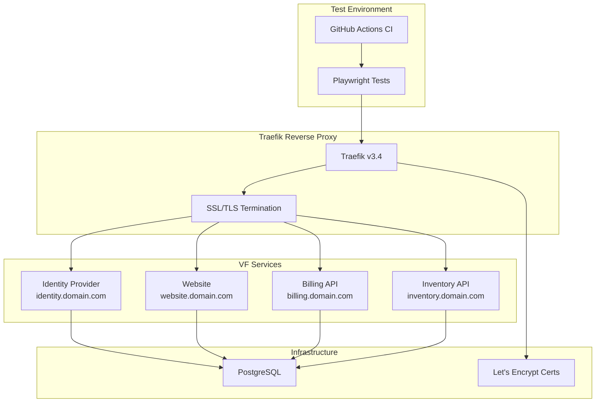
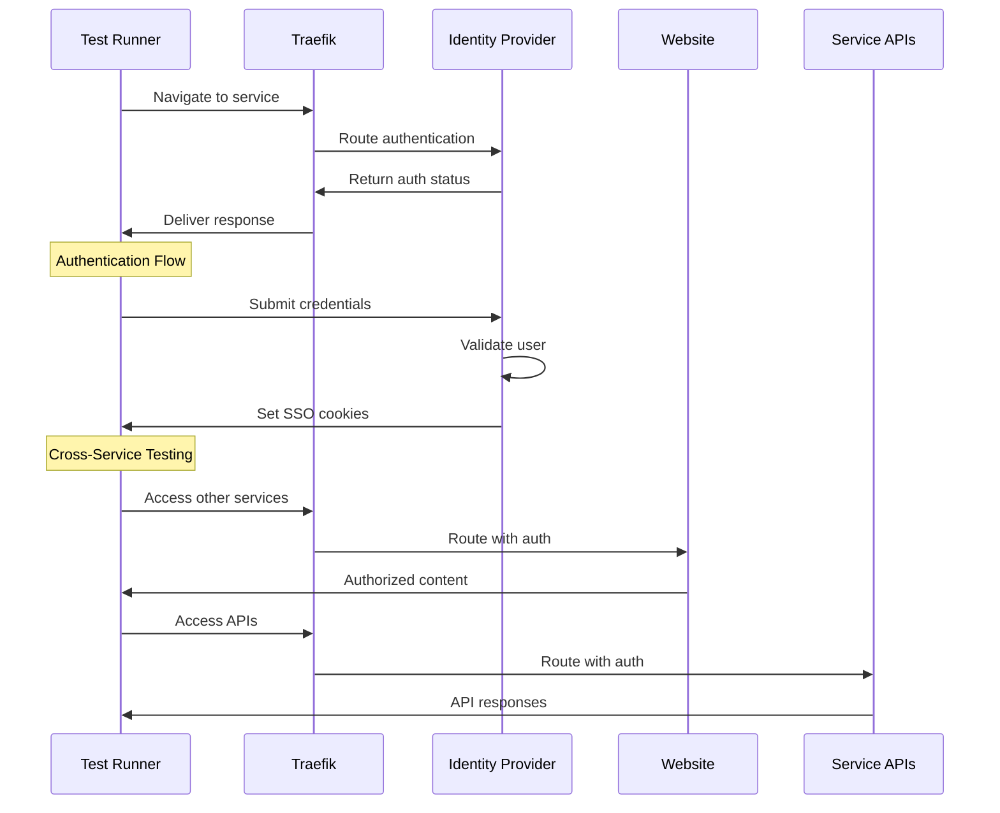
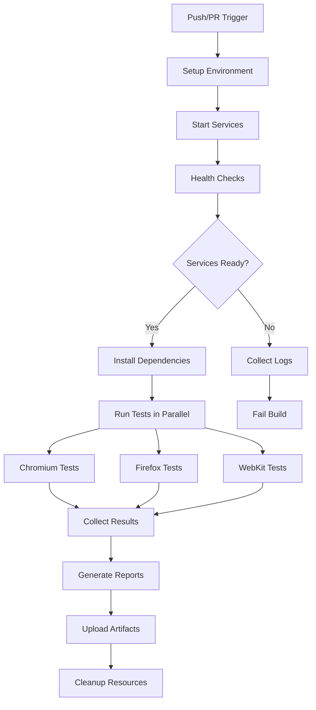

# Playwright E2E Testing Documentation

## Overview

This document describes the implementation of end-to-end testing for VF Services using Playwright. The testing solution provides comprehensive coverage of all services through the Traefik reverse proxy, ensuring real-world routing and authentication scenarios are properly tested.

## Architecture



## Test Categories

### 🎯 **CORS & Cross-Domain Testing**

**Critical Addition**: Enhanced CORS testing to catch cross-domain issues that were previously missed.

- **File**: `tests/playwright/tests/cors/cross-domain-api.spec.js`
- **Purpose**: Test actual browser `fetch()` calls to detect CORS misconfigurations
- **Why Important**: Playwright API tests bypass CORS; only browser context tests catch CORS issues

**Key CORS Tests**:
- Cross-domain API requests from website to identity service
- Console error detection for CORS failures  
- Network request monitoring for failed cross-domain calls
- CORS headers validation in browser responses

📖 **See**: [CORS Testing Strategy Documentation](./CORS_TESTING_STRATEGY.md) for detailed explanation.

### 📱 **JavaScript Integration Testing**

**File**: `tests/playwright/tests/website/javascript-api-integration.spec.js`

Tests the actual JavaScript code execution in browser context:
- Profile page JavaScript API client functionality
- Error handling and loading states
- Token management and authentication flows
- Real browser security policy compliance

## Original Test Categories

### 1. Authentication Tests
- **Login/Logout Flows**: Validates basic authentication mechanisms
- **Single Sign-On (SSO)**: Tests cross-domain authentication
- **Session Management**: Verifies JWT token handling and expiration
- **Security**: Tests unauthorized access protection

### 2. Infrastructure Tests
- **Traefik Routing**: Validates service routing through reverse proxy
- **SSL/TLS**: Ensures proper certificate handling and HTTPS redirection
- **Load Balancing**: Tests service availability and routing consistency
- **Error Handling**: Validates 404 pages and timeout behavior

### 3. Service-Specific Tests
- **Website**: Homepage functionality, navigation, responsive design
- **Identity Provider**: Authentication endpoints and user management
- **Billing API**: Service integration and API functionality
- **Inventory API**: Data management and workflow testing

## Test Flow Diagram



## Implementation Structure

### Directory Layout
```
tests/
├── playwright/
│   ├── config/              # Test configuration
│   │   ├── playwright.config.js
│   │   ├── test-environments.json
│   │   ├── global-setup.js
│   │   └── global-teardown.js
│   ├── pages/              # Page Object Models
│   │   ├── base-page.js
│   │   ├── login-page.js
│   │   └── service-pages/
│   ├── tests/              # Test suites
│   │   ├── auth/
│   │   ├── website/
│   │   ├── billing/
│   │   ├── inventory/
│   │   └── infrastructure/
│   ├── utils/              # Utilities
│   │   ├── helpers.js
│   │   └── api-client.js
│   └── docker/             # Docker configuration
└── package.json
```

### Key Components

#### 1. Base Page Object
Provides common functionality for all page interactions:
- Traefik route navigation
- Authentication state management
- Screenshot and error capture
- Network idle waiting

#### 2. Authentication System
Handles SSO across multiple domains:
- JWT token management
- Cross-domain cookie handling
- Session persistence testing
- Logout verification

#### 3. Test Utilities
- Environment configuration management
- Test data generation and cleanup
- API client for backend testing
- Retry logic with exponential backoff

## Configuration Management

### Environment Setup
Tests support multiple environments through configuration:

```json
{
  "environments": {
    "development": {
      "baseUrl": "https://vfservices.viloforge.com",
      "services": {
        "identity": "https://identity.vfservices.viloforge.com",
        "website": "https://website.vfservices.viloforge.com"
      },
      "testUsers": {
        "admin": {
          "username": "admin",
          "password": "admin123"
        }
      }
    }
  }
}
```

### Docker Integration
Tests run in containerized environment:
- Playwright container with all browsers
- Network isolation using Docker Compose
- Service dependency management
- Health check verification

## CI/CD Integration

### GitHub Actions Workflow


### Test Execution Strategy
- **Parallel Execution**: Multiple browsers tested simultaneously
- **Matrix Strategy**: Cross-browser compatibility validation
- **Artifact Collection**: Screenshots, videos, logs for debugging
- **Retry Logic**: Automatic retry for flaky network operations

## Traefik-Specific Testing

### Routing Validation
Tests verify Traefik configuration:
- Subdomain routing (identity.domain.com → Identity Provider)
- Root domain routing (domain.com → Website)
- SSL certificate handling
- HTTP to HTTPS redirection

### Load Balancer Testing
- Service availability through Traefik
- Header forwarding verification (`passHostHeader=true`)
- Health check endpoint validation
- Concurrent request handling

### Security Testing
- SSL/TLS certificate validation
- Mixed content detection
- Security header verification
- CORS policy testing

## Test Data Management

### User Management
- Test user creation and cleanup
- Role-based access testing
- Session isolation between tests
- Credential rotation support

### Environment Isolation
- Separate test data per environment
- Cleanup procedures after test runs
- Database state management
- Resource cleanup verification

## Monitoring and Reporting

### Test Results
- HTML reports with screenshots and videos
- Cross-browser compatibility matrices
- Performance metrics and timing
- Failure analysis and debugging information

### Metrics Collection
- Test execution time tracking
- Service response time monitoring
- Error rate analysis
- Coverage reporting

## Best Practices

### Test Design
1. **Independent Tests**: Each test should be self-contained
2. **Clean State**: Always start with clean authentication state
3. **Wait Strategies**: Proper handling of Traefik routing delays
4. **Error Handling**: Graceful failure handling with detailed logging
5. **Data Management**: Generate unique test data to avoid conflicts

### Performance Optimization
1. **Parallel Execution**: Run tests concurrently where possible
2. **Selective Testing**: Target specific test suites for faster feedback
3. **Resource Management**: Proper cleanup to prevent resource leaks
4. **Caching**: Leverage browser and dependency caching

### Maintenance
1. **Page Object Updates**: Keep selectors current with UI changes
2. **Environment Sync**: Maintain configuration consistency
3. **Dependency Updates**: Regular Playwright and browser updates
4. **Documentation**: Keep test documentation current

## Troubleshooting Guide

### Common Issues
1. **Service Startup**: Ensure all Docker services are healthy
2. **SSL Certificates**: Verify certificate configuration for test domains
3. **Authentication**: Check test user credentials and SSO configuration
4. **Network Timing**: Adjust wait times for Traefik routing
5. **Browser Compatibility**: Update browser versions and drivers

### Debug Procedures
1. **Local Testing**: Run tests locally with headed browsers
2. **Log Analysis**: Check Traefik and service logs for errors
3. **Network Inspection**: Use browser DevTools for network issues
4. **Step-by-Step**: Use Playwright's debug mode for detailed inspection
5. **Screenshot Review**: Analyze failure screenshots for visual issues

## Future Enhancements

### Planned Improvements
1. **Performance Testing**: Load testing through Traefik
2. **API Testing**: Comprehensive REST API validation
3. **Mobile Testing**: Enhanced mobile browser coverage
4. **Accessibility**: WCAG compliance testing
5. **Visual Regression**: Screenshot comparison testing

### Scalability Considerations
1. **Test Parallelization**: Increase concurrent test execution
2. **Environment Management**: Support for additional test environments
3. **Data Generation**: Enhanced test data factories
4. **Reporting**: Advanced analytics and trend analysis
5. **Integration**: Integration with monitoring and alerting systems

## Security Considerations

### Test Environment Security
- Secure credential management
- Network isolation
- Access control for test environments
- Audit logging for test activities

### Production Testing
- Read-only operations in production
- Minimal test user privileges
- Secure test data handling
- Compliance with data protection regulations