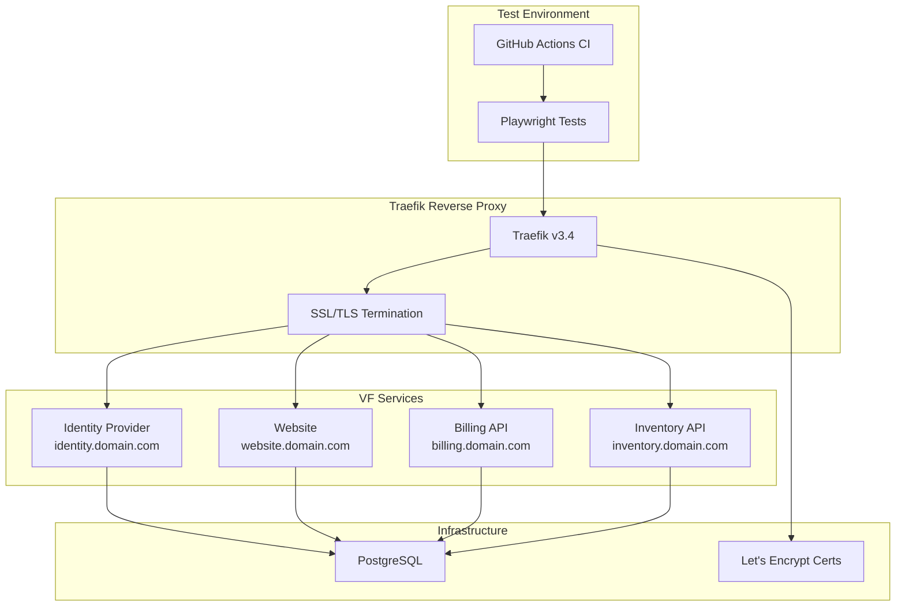
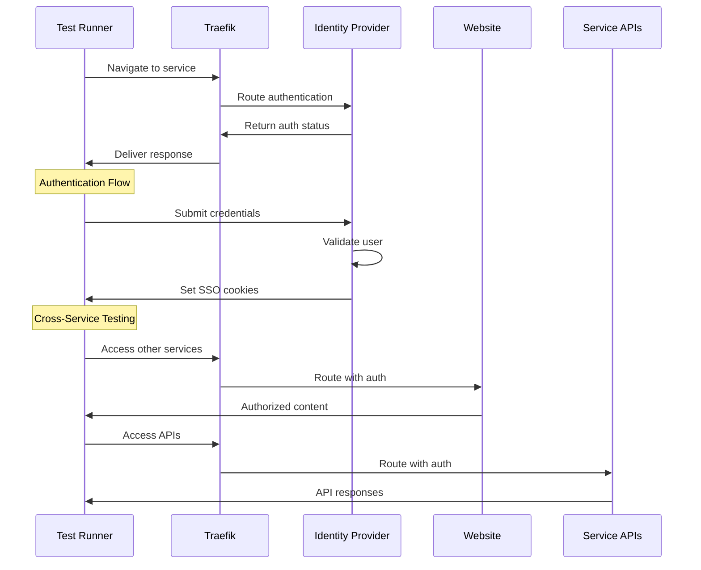
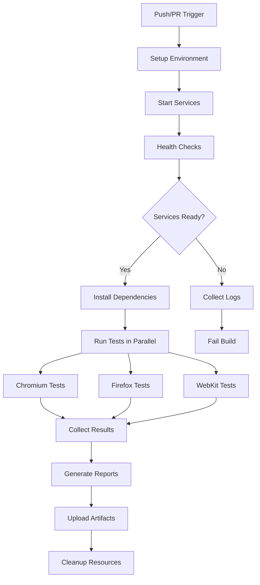

# Playwright E2E Testing Documentation

## Overview

This document describes the implementation of end-to-end testing for VF Services using Playwright. The testing solution provides comprehensive coverage of all services through the Traefik reverse proxy, ensuring real-world routing and authentication scenarios are properly tested.

## Architecture



## Test Categories

### 🎯 **CORS & Cross-Domain Testing**

**Critical Addition**: Enhanced CORS testing to catch cross-domain issues that were previously missed.

- **File**: `tests/playwright/tests/cors/cross-domain-api.spec.js`
- **Purpose**: Test actual browser `fetch()` calls to detect CORS misconfigurations
- **Why Important**: Playwright API tests bypass CORS; only browser context tests catch CORS issues

**Key CORS Tests**:
- Cross-domain API requests from website to identity service
- Console error detection for CORS failures  
- Network request monitoring for failed cross-domain calls
- CORS headers validation in browser responses

📖 **See**: [CORS Testing Strategy Documentation](./CORS_TESTING_STRATEGY.md) for detailed explanation.

### 📱 **JavaScript Integration Testing**

**File**: `tests/playwright/tests/website/javascript-api-integration.spec.js`

Tests the actual JavaScript code execution in browser context:
- Profile page JavaScript API client functionality
- Error handling and loading states
- Token management and authentication flows
- Real browser security policy compliance

## Original Test Categories

### 1. Authentication Tests
- **Login/Logout Flows**: Validates basic authentication mechanisms
- **Single Sign-On (SSO)**: Tests cross-domain authentication
- **Session Management**: Verifies JWT token handling and expiration
- **Security**: Tests unauthorized access protection

### 2. Infrastructure Tests
- **Traefik Routing**: Validates service routing through reverse proxy
- **SSL/TLS**: Ensures proper certificate handling and HTTPS redirection
- **Load Balancing**: Tests service availability and routing consistency
- **Error Handling**: Validates 404 pages and timeout behavior

### 3. Service-Specific Tests
- **Website**: Homepage functionality, navigation, responsive design
- **Identity Provider**: Authentication endpoints and user management
- **Billing API**: Service integration and API functionality
- **Inventory API**: Data management and workflow testing

## Test Flow Diagram



## Implementation Structure

### Directory Layout
```
tests/
├── playwright/
│   ├── config/              # Test configuration
│   │   ├── playwright.config.js
│   │   ├── test-environments.json
│   │   ├── global-setup.js
│   │   └── global-teardown.js
│   ├── pages/              # Page Object Models
│   │   ├── base-page.js
│   │   ├── login-page.js
│   │   └── service-pages/
│   ├── tests/              # Test suites
│   │   ├── auth/
│   │   ├── website/
│   │   ├── billing/
│   │   ├── inventory/
│   │   └── infrastructure/
│   ├── utils/              # Utilities
│   │   ├── helpers.js
│   │   └── api-client.js
│   └── docker/             # Docker configuration
└── package.json
```

### Key Components

#### 1. Base Page Object
Provides common functionality for all page interactions:
- Traefik route navigation
- Authentication state management
- Screenshot and error capture
- Network idle waiting

#### 2. Authentication System
Handles SSO across multiple domains:
- JWT token management
- Cross-domain cookie handling
- Session persistence testing
- Logout verification

#### 3. Test Utilities
- Environment configuration management
- Test data generation and cleanup
- API client for backend testing
- Retry logic with exponential backoff

## Configuration Management

### Environment Setup
Tests support multiple environments through configuration:

```json
{
  "environments": {
    "development": {
      "baseUrl": "https://vfservices.viloforge.com",
      "services": {
        "identity": "https://identity.vfservices.viloforge.com",
        "website": "https://website.vfservices.viloforge.com"
      },
      "testUsers": {
        "admin": {
          "username": "admin",
          "password": "admin123"
        }
      }
    }
  }
}
```

### Enhanced Docker Integration

**Status**: ✅ **FULLY IMPLEMENTED** with comprehensive containerization

**See**: [Docker Testing Strategy](./DOCKER_TESTING_STRATEGY.md) for complete implementation details

#### **Current Docker Infrastructure**
- **Multi-stage Containers**: Development, production, and CI-optimized builds
- **Service Orchestration**: Health checks and dependency management
- **Result Persistence**: Complete test result storage and analysis
- **Multiple Execution Modes**: Full, headed, debug, quick, and CI variants

#### **Available Docker Commands**
```bash
# Enhanced test execution (recommended)
make test-docker-enhanced

# Visual debugging with browser UI
make test-docker-headed

# Interactive debug shell
make test-docker-debug

# Quick smoke tests
make test-quick

# CI-optimized testing
make test-ci-docker
```

#### **Automated Analysis**
- **9-category failure detection** with automated recommendations
- **Performance metrics** and timing analysis
- **HTML/JSON/Markdown reports** with visual charts
- **Real-time monitoring** and web-based report viewing
- **Historical tracking** with trend analysis

## CI/CD Integration

### Enhanced GitHub Actions Workflow

**Status**: ✅ **OPERATIONAL** with Docker-optimized testing


### Current Test Execution Strategy
- **Containerized Execution**: Docker-based testing for consistency
- **Multi-target Testing**: Development, production, and CI optimized builds
- **Comprehensive Analysis**: Automated failure categorization and recommendations
- **Result Persistence**: Complete historical tracking with web interface
- **Multiple Testing Modes**: Full, headed, debug, quick, and CI variants
- **Real-time Monitoring**: Live test result analysis and reporting

#### **Docker Testing Benefits**
- **Environmental Consistency**: Identical browser versions across all systems
- **Enhanced Debugging**: Interactive debug containers with shell access
- **Advanced Analysis**: Comprehensive failure detection and categorization
- **CI/CD Optimization**: Separate container builds for different pipeline stages
- **Result Tracking**: Persistent storage with historical trend analysis

## Traefik-Specific Testing

### Routing Validation
Tests verify Traefik configuration:
- Subdomain routing (identity.domain.com → Identity Provider)
- Root domain routing (domain.com → Website)
- SSL certificate handling
- HTTP to HTTPS redirection

### Load Balancer Testing
- Service availability through Traefik
- Header forwarding verification (`passHostHeader=true`)
- Health check endpoint validation
- Concurrent request handling

### Security Testing
- SSL/TLS certificate validation
- Mixed content detection
- Security header verification
- CORS policy testing

## Test Data Management

### User Management
- Test user creation and cleanup
- Role-based access testing
- Session isolation between tests
- Credential rotation support

### Environment Isolation
- Separate test data per environment
- Cleanup procedures after test runs
- Database state management
- Resource cleanup verification

## Monitoring and Reporting

### Enhanced Test Results (Docker-Based)

**Status**: ✅ **COMPREHENSIVE REPORTING SYSTEM**

#### **Multi-Format Reporting**
- **HTML Reports**: Professional visual analysis with charts and metrics
- **JSON Data**: Machine-readable analysis for CI/CD integration
- **Markdown Summaries**: Quick overview for team communication
- **Web Interface**: Real-time report viewing at http://localhost:8080

#### **Advanced Analysis Features**
- **9-Category Failure Analysis**: Browser, Network/CORS, Authentication, etc.
- **Performance Profiling**: Slowest/fastest tests with timing optimization
- **Pattern Detection**: Flaky test identification and consistent failure tracking
- **Critical Path Analysis**: High-impact failure detection
- **Coverage Mapping**: Test area analysis and gap identification

#### **Automated Recommendations**
- **Priority-based Actions**: Critical, high, medium, low priority suggestions
- **Root Cause Analysis**: Specific recommendations based on failure patterns
- **Infrastructure Guidance**: Docker, browser, and dependency fixes

#### **Historical Tracking**
- **Trend Analysis**: Success rate tracking over time
- **Performance Monitoring**: Test execution time trends
- **Failure Pattern Evolution**: Long-term issue identification
- **Archival System**: Automated result storage and cleanup

### Current Metrics Collection
- **Comprehensive Test Analytics**: 850+ lines of analysis logic
- **Real-time Monitoring**: File system watching for immediate analysis
- **Performance Optimization**: Container and execution time improvements
- **Success Rate Tracking**: Target 95%+ reliability with automated alerts

## Best Practices

### Test Design
1. **Independent Tests**: Each test should be self-contained
2. **Clean State**: Always start with clean authentication state
3. **Wait Strategies**: Proper handling of Traefik routing delays
4. **Error Handling**: Graceful failure handling with detailed logging
5. **Data Management**: Generate unique test data to avoid conflicts

### Performance Optimization
1. **Parallel Execution**: Run tests concurrently where possible
2. **Selective Testing**: Target specific test suites for faster feedback
3. **Resource Management**: Proper cleanup to prevent resource leaks
4. **Caching**: Leverage browser and dependency caching

### Maintenance
1. **Page Object Updates**: Keep selectors current with UI changes
2. **Environment Sync**: Maintain configuration consistency
3. **Dependency Updates**: Regular Playwright and browser updates
4. **Documentation**: Keep test documentation current

## Troubleshooting Guide

### Common Issues
1. **Service Startup**: Ensure all Docker services are healthy
2. **SSL Certificates**: Verify certificate configuration for test domains
3. **Authentication**: Check test user credentials and SSO configuration
4. **Network Timing**: Adjust wait times for Traefik routing
5. **Browser Compatibility**: Update browser versions and drivers

### Enhanced Debug Procedures (Docker-Based)

#### **Interactive Debugging**
```bash
# Visual debugging with browser UI
make test-docker-headed

# Interactive debug shell with full access
make test-docker-debug

# Quick test runs for rapid iteration
make test-quick
```

#### **Analysis-Driven Debugging**
```bash
# Comprehensive failure analysis
make test-analyze TEST_RUN_ID=20241215_143022

# Web-based report viewing
make test-web

# Real-time monitoring
make test-monitor
```

#### **Debug Information Available**
1. **Automated Categorization**: 9 failure categories with specific guidance
2. **Performance Analysis**: Slow test identification and optimization suggestions
3. **Visual Artifacts**: Screenshots, videos, and trace files
4. **Network Analysis**: Complete request/response logging
5. **Historical Context**: Trend analysis for pattern identification
6. **Recommended Actions**: Priority-based fix suggestions

#### **Docker Debug Benefits**
- **Consistent Environment**: Same debugging conditions across all systems
- **Interactive Access**: Full shell access to test container environment
- **Real-time Analysis**: Immediate feedback on test failures
- **Comprehensive Logging**: Complete test execution trace and analysis

## Current Status & Future Enhancements

### ✅ **Recently Implemented (2024)**
1. **✅ Docker Testing Infrastructure**: Multi-stage containers with comprehensive analysis
2. **✅ Enhanced Result Analysis**: 9-category failure detection with recommendations
3. **✅ Performance Monitoring**: Test execution time tracking and optimization
4. **✅ CI/CD Optimization**: GitHub Actions integration with artifact management
5. **✅ Web-based Reporting**: Real-time report viewing and historical tracking

### 🔄 **Current Operational Improvements**
1. **Historical Data Collection**: Building trend analysis dataset
2. **Performance Optimization**: Container and execution time improvements
3. **Maintenance Automation**: Cleanup and archival processes
4. **Enhanced Metrics**: Additional KPIs and success indicators

### 🚀 **Planned Future Improvements**
1. **Advanced Analytics**: Machine learning for failure prediction
2. **Visual Regression**: Automated screenshot comparison testing
3. **Load Testing Integration**: Performance testing through Traefik
4. **Enhanced Mobile Coverage**: Improved mobile browser testing
5. **Accessibility Testing**: WCAG compliance validation

### Current Scalability Implementation

#### ✅ **Implemented Scalability Features**
1. **✅ Docker Parallelization**: Multi-container test execution with orchestration
2. **✅ Multi-Environment Support**: Development, production, and CI-optimized testing
3. **✅ Advanced Reporting**: Comprehensive analytics with trend analysis
4. **✅ Automated Monitoring**: Real-time test result monitoring and alerting
5. **✅ Historical Tracking**: Long-term data collection and archival

#### 🔄 **Ongoing Scalability Improvements**
1. **Performance Optimization**: Container startup time and resource usage
2. **Storage Management**: Automated cleanup and archival strategies
3. **Network Optimization**: Enhanced service communication patterns
4. **Analysis Enhancement**: More sophisticated failure pattern detection

#### 📊 **Current Scale Metrics**
- **Test Execution**: 460+ tests with comprehensive analysis
- **Container Efficiency**: Multi-stage builds for optimal performance
- **Storage Management**: Automated result archival and cleanup
- **Monitoring Coverage**: Real-time analysis with web interface

## Security Considerations

### Enhanced Test Environment Security (Docker-Based)

#### **Container Security**
- **Image Security**: Multi-stage builds with minimal attack surface
- **Network Isolation**: Dedicated Docker networks for test execution
- **Credential Management**: Environment-based secure credential handling
- **Resource Limits**: Container resource constraints and cleanup

#### **Test Data Security**
- **Automated Cleanup**: Complete test data removal after execution
- **Secure Storage**: Encrypted result storage and transmission
- **Access Controls**: Role-based access to test results and reports
- **Audit Logging**: Comprehensive test execution and access logging

#### **CI/CD Security**
- **Secrets Management**: GitHub Actions secrets for sensitive data
- **Artifact Security**: Secure upload and storage of test artifacts
- **Environment Isolation**: Separate security contexts for different environments
- **Compliance Monitoring**: Automated security scanning of test containers

### Production Testing Security
- **Read-only Operations**: Non-destructive testing in production environments
- **Minimal Privileges**: Test users with restricted access permissions
- **Data Protection**: GDPR/CCPA compliant test data handling
- **Security Monitoring**: Real-time security event detection during testing