# Profile System Architecture Documentation

## Overview

This document provides comprehensive technical documentation for the VF Services profile system, covering the implementation across the Identity Provider (backend API) and Website (frontend client), including authentication, CORS configuration, and patterns for extending to other services.

## Table of Contents

1. [System Architecture](#system-architecture)
2. [Identity Provider Implementation](#identity-provider-implementation)
3. [Website Integration](#website-integration)
4. [Authentication & JWT Token Management](#authentication--jwt-token-management)
5. [CORS Configuration](#cors-configuration)
6. [Extending to Other Services](#extending-to-other-services)
7. [Best Practices](#best-practices)
8. [Troubleshooting](#troubleshooting)

## System Architecture

The profile system follows a microservices architecture with **client-side API consumption**:

- **Identity Provider** serves as the central authentication and user data service
- **Website** acts as a frontend client consuming Identity Provider APIs **via JavaScript/TypeScript**
- **Billing** and **Inventory** services (future) will follow the same client pattern
- **Traefik** handles routing and SSL termination for all services

### 🎯 **IMPORTANT ARCHITECTURAL PRINCIPLE**

**Website Django views should NOT make API calls to other services.** Instead:

1. **Django views** serve HTML templates and handle authentication/routing
2. **JavaScript/TypeScript** in the browser makes API calls to populate pages
3. **API responses** are consumed client-side for better performance and user experience

This pattern provides:
- **Better responsiveness** - Pages load immediately, data loads asynchronously
- **Improved error handling** - JavaScript can show loading states and handle failures gracefully
- **Reduced server load** - Django doesn't need to make external HTTP requests
- **Better scalability** - Client-side caching and parallel requests
- **Modern UX patterns** - Progressive loading, real-time updates

```mermaid
graph TD
    %% External Users
    User[🧑‍💻 User Browser]
    
    %% Traefik Proxy Layer
    Traefik[🔀 Traefik Proxy<br/>SSL Termination & Routing]
    
    %% Core Services
    Website[🌐 Website Service<br/>Django Frontend<br/>Template Rendering Only]
    Identity[🔐 Identity Provider<br/>JWT Authentication<br/>User Profile API]
    Billing[💰 Billing Service<br/>Payment API<br/>Transaction History]
    Inventory[📦 Inventory Service<br/>Asset Management<br/>Product Catalog]
    
    %% External Dependencies
    DB[(🗄️ PostgreSQL<br/>User Data)]
    
    %% User interactions
    User -->|HTTPS Requests| Traefik
    
    %% Traefik routing
    Traefik -->|Route: /| Website
    Traefik -->|Route: /api/auth/*| Identity
    Traefik -->|Route: /api/billing/*| Billing  
    Traefik -->|Route: /api/inventory/*| Inventory
    
    %% Client-side API calls (JavaScript in browser)
    User -.->|"🔄 JavaScript API Calls<br/>with JWT Bearer Tokens"| Identity
    User -.->|"🔄 JavaScript API Calls<br/>with JWT Bearer Tokens"| Billing
    User -.->|"🔄 JavaScript API Calls<br/>with JWT Bearer Tokens"| Inventory
    
    %% Database connections
    Identity -->|Auth & Profile Data| DB
    Billing -->|Billing Records| DB
    Inventory -->|Product Data| DB
    
    %% JWT Token Flow
    Identity -.->|"🎫 JWT Cookies<br/>(HttpOnly + Accessible)"| User
    
    %% Service Architecture Notes
    classDef clientService fill:#e1f5fe,stroke:#01579b,stroke-width:2px,color:#000
    classDef apiService fill:#f3e5f5,stroke:#4a148c,stroke-width:2px,color:#000
    classDef infrastructure fill:#fff3e0,stroke:#e65100,stroke-width:2px,color:#000
    classDef database fill:#e8f5e8,stroke:#2e7d32,stroke-width:2px,color:#000
    classDef user fill:#fce4ec,stroke:#880e4f,stroke-width:2px,color:#000
    
    class Website,User clientService
    class Identity,Billing,Inventory apiService
    class Traefik infrastructure
    class DB database
    class User user
```



**Key Architecture Principles:**

1. **🎯 Client-Side API Consumption**: Website serves HTML templates only; JavaScript makes API calls
2. **🔐 JWT Authentication**: Centralized auth via Identity Provider with token-based API access
3. **🔀 Traefik Routing**: Single entry point with path-based service routing
4. **🏗️ Microservices**: Each service is independent with its own API endpoints
5. **📱 Progressive Loading**: Pages render immediately, data loads asynchronously

## Identity Provider Implementation

### 1. Profile API Endpoint

**File**: `identity-provider/identity_app/views.py:678`

The profile endpoint provides authenticated access to user profile information:

```python
@api_view(['GET'])
@permission_classes([IsAuthenticated])
@swagger_auto_schema(
    operation_description="Get user profile information",
    responses={
        200: openapi.Response(
            description='User profile information',
            schema=openapi.Schema(
                type=openapi.TYPE_OBJECT,
                properties={
                    'username': openapi.Schema(type=openapi.TYPE_STRING),
                    'email': openapi.Schema(type=openapi.TYPE_STRING),
                    'timestamp': openapi.Schema(type=openapi.TYPE_STRING)
                }
            )
        ),
        401: 'Unauthorized - Valid JWT token required'
    }
)
def api_profile(request):
    """API endpoint to get user profile information."""
    try:
        user_profile = {
            "username": request.user.username,
            "email": request.user.email,
            "timestamp": timezone.now().isoformat()
        }
        return Response(user_profile)
    except Exception as e:
        return Response(
            {"detail": "Failed to retrieve profile"}, 
            status=status.HTTP_500_INTERNAL_SERVER_ERROR
        )
```

**Key Features:**
- JWT authentication required via `@permission_classes([IsAuthenticated])`
- Returns sanitized user data (no sensitive fields)
- Comprehensive error handling and logging
- Swagger/OpenAPI documentation integration
- ISO timestamp for response tracking

### 2. URL Configuration

**File**: `identity-provider/identity_app/urls.py:11`

```python
urlpatterns = [
    path('api/profile/', views.api_profile, name='api_profile'),
    # ... other endpoints
]
```

### 3. Authentication Middleware

**File**: `identity-provider/main/settings.py:71`

```python
MIDDLEWARE = [
    # ... other middleware
    "common.jwt_auth.middleware.JWTAuthenticationMiddleware",
    # ... rest of middleware
]
```

The JWT middleware handles token validation for all authenticated endpoints.

### 4. API Documentation Integration

**File**: `identity-provider/identity_app/views.py:614`

The profile endpoint is automatically documented in the API info endpoint:

```python
"/api/profile/": {
    "method": "GET",
    "description": "Get user profile information",
    "authentication": "JWT Token Required",
    "returns": {
        "username": "string",
        "email": "string", 
        "timestamp": "ISO datetime"
    }
}
```

## Website Integration

### 🏗️ **Django Views Architecture Pattern**

**CRITICAL**: Website Django views should follow this pattern:

#### ✅ **CORRECT Pattern - Template Serving Only**

```python
# website/accounts/views.py
from django.shortcuts import render
from django.contrib.auth.decorators import login_required

@login_required
def profile_view(request):
    """
    Serve the profile template - NO API calls here!
    JavaScript will handle all data loading.
    """
    context = {
        'page_title': 'User Profile',
        'user': request.user,  # Only basic template data
    }
    return render(request, 'accounts/profile.html', context)
```

#### ❌ **INCORRECT Pattern - Avoid This**

```python
# DON'T DO THIS - Django views should NOT make API calls
@login_required  
def profile_view(request):
    # ❌ WRONG: Making API calls in Django view
    import requests
    api_response = requests.get('https://identity.../api/profile/')
    profile_data = api_response.json()
    
    context = {'profile': profile_data}
    return render(request, 'accounts/profile.html', context)
```

**Why client-side API consumption is better:**
- **Faster page loads** - HTML renders immediately
- **Better error handling** - JavaScript can retry, show spinners, handle failures
- **Improved scalability** - No server-side HTTP dependencies
- **Modern UX** - Progressive loading, partial updates, real-time data
- **Reduced coupling** - Website service doesn't depend on other services being available

### 1. Profile Page Template

**File**: `website/accounts/templates/accounts/profile.html`

The profile page provides a responsive Bootstrap-based interface:

```html
<div class="row">
    <div class="col-12">
        <div class="card">
            <div class="card-header">
                <h4 class="card-title">Profile Information</h4>
            </div>
            <div class="card-body">
                <div id="profile-loading" class="text-center">
                    <div class="spinner-border" role="status">
                        <span class="sr-only">Loading...</span>
                    </div>
                    <p>Loading profile information...</p>
                </div>
                
                <div id="profile-content" style="display: none;">
                    <div class="row">
                        <div class="col-md-6">
                            <div class="form-group">
                                <label>Username</label>
                                <p id="profile-username" class="form-control-plaintext"></p>
                            </div>
                        </div>
                        <div class="col-md-6">
                            <div class="form-group">
                                <label>Email</label>
                                <p id="profile-email" class="form-control-plaintext"></p>
                            </div>
                        </div>
                    </div>
                </div>
                
                <div id="profile-error" style="display: none;" class="alert alert-danger">
                    <h6>Error Loading Profile</h6>
                    <p id="error-message"></p>
                </div>
            </div>
        </div>
    </div>
</div>
```

**Key Features:**
- Loading states with Bootstrap spinners
- Error handling with user-friendly messages
- Responsive design for mobile/desktop
- Semantic HTML structure

### 2. JavaScript API Client

**File**: `website/static/assets/js/identity-api-client.js`

The Identity API client handles all communication with the Identity Provider:

```javascript
class IdentityAPIClient {
    constructor() {
        this.baseURL = this.getIdentityBaseURL();
        this.defaultHeaders = {
            'Content-Type': 'application/json',
        };
    }

    // Get JWT token from cookies (both httpOnly and JS-accessible)
    getJWTToken() {
        // Try to get from JS-accessible cookie first
        let token = this.getCookie('jwt_token');
        if (!token) {
            // Fallback to httpOnly cookie (won't work from JS, but documents the pattern)
            token = this.getCookie('jwt');
        }
        return token;
    }

    // Make authenticated request to profile endpoint
    async getProfile() {
        const token = this.getJWTToken();
        if (!token) {
            throw new Error('No authentication token found');
        }

        const headers = {
            ...this.defaultHeaders,
            'Authorization': `Bearer ${token}`
        };

        const response = await fetch(`${this.baseURL}/api/profile/`, {
            method: 'GET',
            headers: headers,
            credentials: 'include' // Include cookies for CORS
        });

        if (!response.ok) {
            const errorData = await response.json().catch(() => ({}));
            throw new Error(errorData.detail || `HTTP ${response.status}: ${response.statusText}`);
        }

        return await response.json();
    }
}
```

**Key Features:**
- Automatic token detection from cookies
- Support for both header and cookie authentication
- Comprehensive error handling
- CORS-compatible request configuration
- Extensible for additional endpoints

### 3. Profile Page JavaScript Integration

**File**: `website/accounts/templates/accounts/profile.html` (script section)

```javascript
document.addEventListener('DOMContentLoaded', async function() {
    const apiClient = new IdentityAPIClient();
    
    try {
        // Load profile data
        const profileData = await apiClient.getProfile();
        
        // Update UI
        document.getElementById('profile-username').textContent = profileData.username;
        document.getElementById('profile-email').textContent = profileData.email;
        
        // Show content, hide loading
        document.getElementById('profile-loading').style.display = 'none';
        document.getElementById('profile-content').style.display = 'block';
        
    } catch (error) {
        console.error('Failed to load profile:', error);
        
        // Show error state
        document.getElementById('profile-loading').style.display = 'none';
        document.getElementById('error-message').textContent = error.message;
        document.getElementById('profile-error').style.display = 'block';
    }
});
```

## Authentication & JWT Token Management

### 1. Token Storage Strategy

The system uses a **dual-cookie approach** for maximum compatibility:

```python
# identity-provider/identity_app/views.py (login endpoint)
if remember_me:
    # 24 hour expiration for "remember me"
    response.set_cookie('jwt', token, max_age=86400, httponly=True, secure=True, samesite='Lax')
    response.set_cookie('jwt_token', token, max_age=86400, httponly=False, secure=True, samesite='Lax')
else:
    # Session cookies (expire when browser closes)
    response.set_cookie('jwt', token, httponly=True, secure=True, samesite='Lax')
    response.set_cookie('jwt_token', token, httponly=False, secure=True, samesite='Lax')
```

**Cookie Types:**
- `jwt` (HttpOnly): Secure cookie for server-side validation
- `jwt_token` (Accessible): JavaScript-accessible cookie for API calls

### 2. Token Validation

**File**: `common/jwt_auth/middleware.py`

The JWT middleware validates tokens on every request:

```python
class JWTAuthenticationMiddleware:
    def __init__(self, get_response):
        self.get_response = get_response

    def __call__(self, request):
        # Try to get token from cookie or Authorization header
        token = request.COOKIES.get('jwt') or self.get_bearer_token(request)
        
        if token:
            try:
                payload = jwt.decode(token, settings.JWT_SECRET, algorithms=['HS256'])
                # Validate user and set request.user
                user = User.objects.get(username=payload['username'])
                request.user = user
            except (jwt.ExpiredSignatureError, jwt.InvalidTokenError, User.DoesNotExist):
                # Token invalid - user remains anonymous
                pass
        
        return self.get_response(request)
```

### 3. Token Security Features

- **HTTPS Only**: Tokens are only transmitted over secure connections
- **SameSite Protection**: Prevents CSRF attacks via SameSite=Lax
- **Expiration Handling**: Tokens have configurable expiration times
- **Signature Validation**: JWT signatures prevent tampering

## CORS Configuration

### 1. Current CORS Setup

**File**: `identity-provider/main/settings.py:204`

```python
# Simplified CORS configuration for better debugging
CORS_ALLOWED_ORIGINS = [
    "https://identity.vfservices.viloforge.com",
    "http://identity.vfservices.viloforge.com", 
    "https://vfservices.viloforge.com",  # Main website domain
    "http://vfservices.viloforge.com",   # Main website domain (HTTP)
    "https://website.vfservices.viloforge.com",  # Website subdomain
    "http://website.vfservices.viloforge.com",   # Website subdomain (HTTP)
    "http://localhost:8000",
    "http://127.0.0.1:8000",
    "http://127.0.0.1:8100",
    "https://localhost",  # For local development/testing
    "http://localhost",   # For local development/testing
]

CORS_ALLOW_CREDENTIALS = True  # Required for cookie authentication
```

### 2. Advanced CORS Discovery System

**File**: `identity-provider/identity_app/cors_discovery.py`

The system includes an advanced CORS discovery mechanism:

```python
class TraefikIntegratedCORS:
    def __init__(self, environment='development'):
        self.environment = environment
        self.base_domain = os.environ.get('BASE_DOMAIN', 'vfservices.viloforge.com')
        self.origins = []
        
    def configure_origins(self):
        # Add the main base domain (for main website access)
        if self.environment == 'production':
            self.origins.append(f"https://{self.base_domain}")
        else:
            self.origins.extend([
                f"https://{self.base_domain}",
                f"http://{self.base_domain}"
            ])
        
        # Auto-discover service subdomains
        for service in self.discovered_services:
            service_domain = f"{service}.{self.base_domain}"
            if self.environment == 'production':
                self.origins.append(f"https://{service_domain}")
            else:
                self.origins.extend([
                    f"https://{service_domain}",
                    f"http://{service_domain}"
                ])
```

### 3. CORS Headers Configuration

```python
CORS_ALLOWED_HEADERS = [
    'accept',
    'accept-encoding',
    'authorization',      # Required for JWT Bearer tokens
    'content-type',
    'dnt',
    'origin',
    'user-agent',
    'x-csrftoken',
    'x-requested-with',
]

CORS_ALLOW_METHODS = [
    'DELETE',
    'GET',
    'OPTIONS',
    'PATCH',
    'POST',
    'PUT',
]
```

## Extending to Other Services

### 1. Implementing API Endpoints in Billing/Inventory Services

#### Step 1: Add JWT Middleware

**File**: `billing-api/main/settings.py` or `inventory-api/main/settings.py`

```python
MIDDLEWARE = [
    # ... existing middleware
    "common.jwt_auth.middleware.JWTAuthenticationMiddleware",
    # ... rest of middleware
]

# JWT Configuration
JWT_SECRET = os.environ.get("VF_JWT_SECRET", "change-me")
```

#### Step 2: Create API Endpoints

**File**: `billing-api/billing/views.py`

```python
from rest_framework.decorators import api_view, permission_classes
from rest_framework.permissions import IsAuthenticated
from rest_framework.response import Response
from django.utils import timezone

@api_view(['GET'])
@permission_classes([IsAuthenticated])
def api_billing_summary(request):
    """Get user's billing summary."""
    try:
        # Example billing data (replace with actual logic)
        billing_data = {
            "user": request.user.username,
            "current_balance": "0.00",
            "billing_cycle": "monthly",
            "next_billing_date": "2024-07-01",
            "timestamp": timezone.now().isoformat()
        }
        return Response(billing_data)
    except Exception as e:
        return Response(
            {"detail": "Failed to retrieve billing information"}, 
            status=500
        )

@api_view(['GET'])
@permission_classes([IsAuthenticated])
def api_recent_transactions(request):
    """Get user's recent transactions."""
    try:
        # Example transaction data
        transactions = {
            "user": request.user.username,
            "transactions": [
                {
                    "id": "txn_001",
                    "amount": "29.99",
                    "description": "Monthly Service Fee",
                    "date": "2024-06-01",
                    "status": "completed"
                }
            ],
            "timestamp": timezone.now().isoformat()
        }
        return Response(transactions)
    except Exception as e:
        return Response(
            {"detail": "Failed to retrieve transactions"}, 
            status=500
        )
```

#### Step 3: Configure URLs

**File**: `billing-api/billing/urls.py`

```python
from django.urls import path
from . import views

urlpatterns = [
    path('api/billing/summary/', views.api_billing_summary, name='api_billing_summary'),
    path('api/billing/transactions/', views.api_recent_transactions, name='api_recent_transactions'),
]
```

#### Step 4: Add CORS Configuration

**File**: `billing-api/main/settings.py`

```python
# Copy CORS configuration from identity-provider
CORS_ALLOWED_ORIGINS = [
    "https://identity.vfservices.viloforge.com",
    "https://vfservices.viloforge.com",
    "https://website.vfservices.viloforge.com",
    # ... add other origins as needed
]

CORS_ALLOW_CREDENTIALS = True
CORS_ALLOWED_HEADERS = [
    'accept',
    'accept-encoding', 
    'authorization',
    'content-type',
    'origin',
    'user-agent',
]
```

### 2. Consuming APIs from Website/Client Applications

#### Step 1: Extend the API Client

**File**: `website/static/assets/js/billing-api-client.js`

```javascript
class BillingAPIClient {
    constructor() {
        this.baseURL = this.getBillingBaseURL();
        this.defaultHeaders = {
            'Content-Type': 'application/json',
        };
    }

    getBillingBaseURL() {
        // Use Traefik routing to billing service
        const protocol = window.location.protocol;
        const hostname = window.location.hostname;
        
        if (hostname === 'localhost' || hostname === '127.0.0.1') {
            return `${protocol}//localhost`; // Traefik handles routing
        }
        
        // Production: use billing subdomain
        return `${protocol}//billing.vfservices.viloforge.com`;
    }

    getJWTToken() {
        return this.getCookie('jwt_token');
    }

    async getBillingSummary() {
        const token = this.getJWTToken();
        if (!token) {
            throw new Error('No authentication token found');
        }

        const headers = {
            ...this.defaultHeaders,
            'Authorization': `Bearer ${token}`
        };

        const response = await fetch(`${this.baseURL}/api/billing/summary/`, {
            method: 'GET',
            headers: headers,
            credentials: 'include'
        });

        if (!response.ok) {
            const errorData = await response.json().catch(() => ({}));
            throw new Error(errorData.detail || `HTTP ${response.status}`);
        }

        return await response.json();
    }

    async getRecentTransactions() {
        const token = this.getJWTToken();
        if (!token) {
            throw new Error('No authentication token found');
        }

        const headers = {
            ...this.defaultHeaders,
            'Authorization': `Bearer ${token}`
        };

        const response = await fetch(`${this.baseURL}/api/billing/transactions/`, {
            method: 'GET',
            headers: headers,
            credentials: 'include'
        });

        if (!response.ok) {
            const errorData = await response.json().catch(() => ({}));
            throw new Error(errorData.detail || `HTTP ${response.status}`);
        }

        return await response.json();
    }

    // Helper method to get cookies (same as IdentityAPIClient)
    getCookie(name) {
        const value = `; ${document.cookie}`;
        const parts = value.split(`; ${name}=`);
        if (parts.length === 2) return parts.pop().split(';').shift();
    }
}
```

#### Step 2: Create Website Django Views (Template Serving Only)

**File**: `website/views.py`

```python
from django.shortcuts import render
from django.contrib.auth.decorators import login_required

@login_required
def dashboard_view(request):
    """
    Dashboard view - serves template only, NO API calls!
    JavaScript will load all data from multiple services.
    """
    context = {
        'page_title': 'Dashboard',
        'user': request.user,
    }
    return render(request, 'dashboard.html', context)

@login_required
def billing_view(request):
    """
    Billing page view - serves template only.
    JavaScript will load billing data from billing service.
    """
    context = {
        'page_title': 'Billing',
        'user': request.user,
    }
    return render(request, 'billing.html', context)

@login_required
def inventory_view(request):
    """
    Inventory page view - serves template only.
    JavaScript will load inventory data from inventory service.
    """
    context = {
        'page_title': 'Inventory',
        'user': request.user,
    }
    return render(request, 'inventory.html', context)
```

**Key Points:**
- Django views only handle authentication and template rendering
- No HTTP requests to other services in Django views
- All API consumption happens client-side via JavaScript
- This pattern maintains loose coupling between services

#### Step 3: Create Dashboard Page Integration

**File**: `website/templates/dashboard.html`

```html
<div class="row">
    <!-- Profile Information -->
    <div class="col-md-6">
        <div class="card">
            <div class="card-header">
                <h4 class="card-title">Profile</h4>
            </div>
            <div class="card-body" id="profile-section">
                <!-- Profile content loaded via IdentityAPIClient -->
            </div>
        </div>
    </div>
    
    <!-- Billing Information -->
    <div class="col-md-6">
        <div class="card">
            <div class="card-header">
                <h4 class="card-title">Billing Summary</h4>
            </div>
            <div class="card-body" id="billing-section">
                <!-- Billing content loaded via BillingAPIClient -->
            </div>
        </div>
    </div>
</div>

<script>
document.addEventListener('DOMContentLoaded', async function() {
    const identityClient = new IdentityAPIClient();
    const billingClient = new BillingAPIClient();
    
    try {
        // Load data from multiple services in parallel
        const [profileData, billingData] = await Promise.all([
            identityClient.getProfile(),
            billingClient.getBillingSummary()
        ]);
        
        // Update profile section
        document.getElementById('profile-section').innerHTML = `
            <p><strong>Username:</strong> ${profileData.username}</p>
            <p><strong>Email:</strong> ${profileData.email}</p>
        `;
        
        // Update billing section
        document.getElementById('billing-section').innerHTML = `
            <p><strong>Current Balance:</strong> $${billingData.current_balance}</p>
            <p><strong>Billing Cycle:</strong> ${billingData.billing_cycle}</p>
            <p><strong>Next Billing:</strong> ${billingData.next_billing_date}</p>
        `;
        
    } catch (error) {
        console.error('Failed to load dashboard data:', error);
        // Handle errors appropriately for each section
    }
});
</script>
```

### 3. React Client Implementation

For future React applications, create a centralized API client:

**File**: `react-client/src/services/VFServicesAPI.js`

```javascript
class VFServicesAPI {
    constructor() {
        this.services = {
            identity: process.env.REACT_APP_IDENTITY_URL || 'https://identity.vfservices.viloforge.com',
            billing: process.env.REACT_APP_BILLING_URL || 'https://billing.vfservices.viloforge.com',
            inventory: process.env.REACT_APP_INVENTORY_URL || 'https://inventory.vfservices.viloforge.com'
        };
    }

    async makeAuthenticatedRequest(serviceUrl, endpoint, options = {}) {
        // Get token from localStorage, sessionStorage, or cookies
        const token = this.getStoredToken();
        
        const defaultOptions = {
            headers: {
                'Content-Type': 'application/json',
                'Authorization': `Bearer ${token}`,
                ...options.headers
            },
            credentials: 'include'
        };

        const response = await fetch(`${serviceUrl}${endpoint}`, {
            ...defaultOptions,
            ...options
        });

        if (!response.ok) {
            if (response.status === 401) {
                // Handle token expiration
                this.handleTokenExpiration();
            }
            throw new Error(`API Error: ${response.status}`);
        }

        return await response.json();
    }

    // Service-specific methods
    async getProfile() {
        return await this.makeAuthenticatedRequest(
            this.services.identity, 
            '/api/profile/'
        );
    }

    async getBillingSummary() {
        return await this.makeAuthenticatedRequest(
            this.services.billing, 
            '/api/billing/summary/'
        );
    }

    async getInventoryItems() {
        return await this.makeAuthenticatedRequest(
            this.services.inventory, 
            '/api/inventory/items/'
        );
    }
}

export default VFServicesAPI;
```

## Best Practices

### 1. Architecture Best Practices

#### 🎯 **Client-Side API Consumption Pattern**

**ALWAYS follow this pattern for website views:**

```python
# ✅ CORRECT: Django view serves template only
@login_required
def my_page_view(request):
    return render(request, 'my_page.html', {'user': request.user})
```

```javascript
// ✅ CORRECT: JavaScript loads data
document.addEventListener('DOMContentLoaded', async function() {
    const apiClient = new MyAPIClient();
    const data = await apiClient.getData();
    updateUI(data);
});
```

**❌ NEVER do this:**

```python
# ❌ WRONG: Django view making API calls
@login_required  
def my_page_view(request):
    import requests
    api_data = requests.get('https://api.../data/').json()  # DON'T DO THIS
    return render(request, 'my_page.html', {'data': api_data})
```

**Benefits of client-side API consumption:**
- **Faster initial page loads** - HTML renders immediately
- **Better error handling** - JavaScript can show loading states, retry failed requests
- **Improved scalability** - Website doesn't become a bottleneck for other services
- **Loose coupling** - Services remain independent
- **Modern UX patterns** - Progressive loading, real-time updates, partial refreshes

### 2. Security Best Practices

- **Always validate JWT tokens** on the server side
- **Use HTTPS in production** for all token transmission
- **Set appropriate cookie flags** (HttpOnly, Secure, SameSite)
- **Implement token expiration** and refresh mechanisms
- **Sanitize API responses** - never expose sensitive user data
- **Log authentication attempts** for security monitoring

### 2. Error Handling Best Practices

- **Provide user-friendly error messages** in the frontend
- **Log detailed errors** on the server side for debugging
- **Handle network failures gracefully** with retry mechanisms
- **Validate input data** on both client and server
- **Use appropriate HTTP status codes** (401 for auth, 403 for permission, etc.)

### 3. Performance Best Practices

- **Cache API responses** where appropriate
- **Use parallel requests** when loading data from multiple services
- **Implement loading states** for better user experience
- **Minimize API calls** by batching requests when possible
- **Use CDN for static assets** like the API client JavaScript

### 4. Development Best Practices

- **Document all API endpoints** with OpenAPI/Swagger
- **Write comprehensive tests** for both backend and frontend
- **Use consistent naming conventions** across services
- **Implement proper logging** for debugging and monitoring
- **Version your APIs** to support backward compatibility

## Troubleshooting

### 1. Common CORS Issues

**Problem**: "Access to fetch at '...' has been blocked by CORS policy"

**Solutions**:
- Verify the client origin is in `CORS_ALLOWED_ORIGINS`
- Check that `CORS_ALLOW_CREDENTIALS = True` if using cookies
- Ensure the `Authorization` header is in `CORS_ALLOWED_HEADERS`
- Verify Traefik is not interfering with CORS headers

### 2. Authentication Issues

**Problem**: "Authentication credentials were not provided" (403 error)

**Solutions**:
- Verify JWT token is being sent in the request
- Check token hasn't expired (`jwt.decode` will raise `ExpiredSignatureError`)
- Ensure JWT secret matches between services
- Verify the JWT middleware is properly configured

### 3. Token Storage Issues

**Problem**: JavaScript can't access JWT token

**Solutions**:
- Ensure `jwt_token` cookie is set with `httponly=False`
- Check cookie domain and path settings
- Verify SameSite policy allows the request
- Confirm HTTPS is used in production

### 4. Service Discovery Issues

**Problem**: API calls fail with network errors

**Solutions**:
- Verify Traefik routing configuration
- Check service hostnames resolve correctly
- Ensure services are running and healthy
- Verify firewall rules allow inter-service communication

### 5. Development vs Production Differences

**Problem**: Works locally but fails in production

**Solutions**:
- Check environment-specific CORS origins
- Verify SSL certificates are valid
- Ensure production JWT secrets are configured
- Check production database connections and migrations

## Testing

### 1. API Endpoint Testing

Use Playwright tests to verify API functionality:

```javascript
// tests/playwright/tests/auth/profile.spec.js
test('should return profile data with valid token', async () => {
    const response = await apiClient.testProfileEndpoint(adminToken);
    
    expect(response.status).toBe(200);
    expect(response.data).toHaveProperty('username');
    expect(response.data).toHaveProperty('email');
    expect(response.data).toHaveProperty('timestamp');
});
```

### 2. Integration Testing

Test the complete workflow from login to API access:

```javascript
// tests/playwright/tests/website/profile.spec.js
test('should complete full login to profile workflow', async ({ page }) => {
    await page.goto('/accounts/login/');
    await page.fill('input[name="email"]', 'admin');
    await page.fill('input[name="password"]', 'admin123');
    await page.click('button[type="submit"]');
    
    await page.goto('/accounts/profile/');
    await expect(page.locator('#profile-username')).toContainText('admin');
});
```

## Summary

This documentation provides the foundation for understanding and extending the VF Services profile system. 

### 🎯 **Key Architectural Principle to Remember**

**Website Django views should ONLY serve templates and handle authentication/routing. ALL API data consumption should happen client-side via JavaScript/TypeScript.**

This pattern ensures:
- **Fast, responsive user interfaces**
- **Scalable microservices architecture** 
- **Loose coupling between services**
- **Modern, progressive web application experience**

Follow these patterns when implementing new API endpoints or client integrations to maintain consistency, performance, and security across the platform.

### Quick Reference

1. **Identity Provider**: Provides JWT-secured API endpoints
2. **Website Django Views**: Serve HTML templates only (no API calls)
3. **Website JavaScript**: Consumes APIs and populates pages
4. **CORS**: Configured to allow cross-domain API access
5. **JWT Tokens**: Stored in dual cookies for security and accessibility
6. **Other Services**: Follow the same API endpoint + client-side consumption pattern