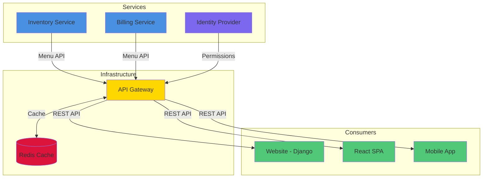
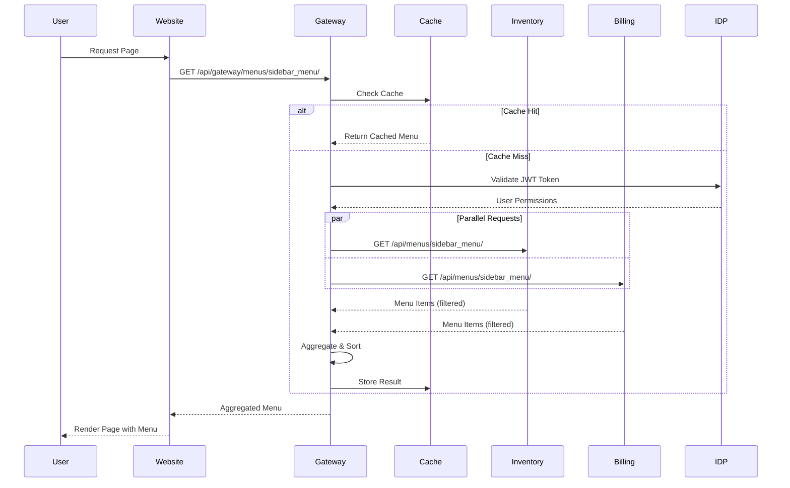
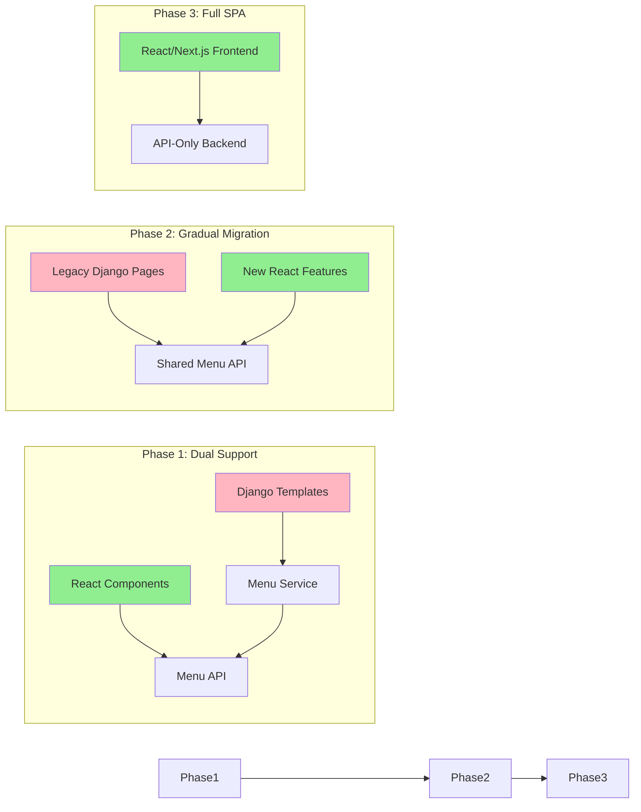
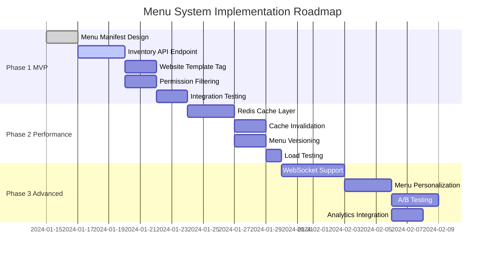
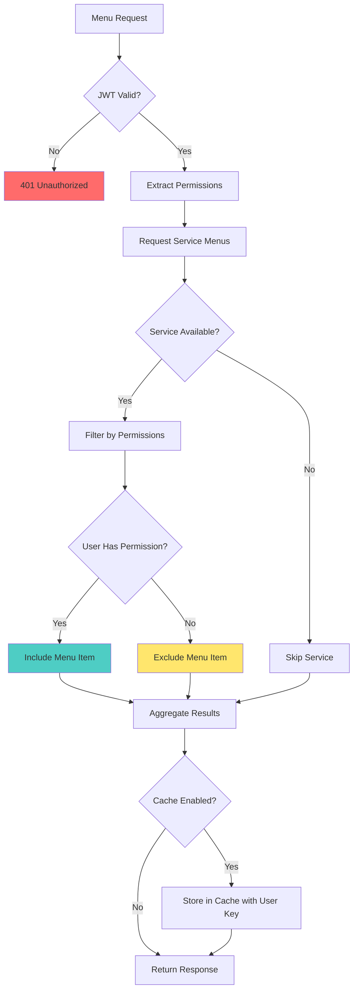
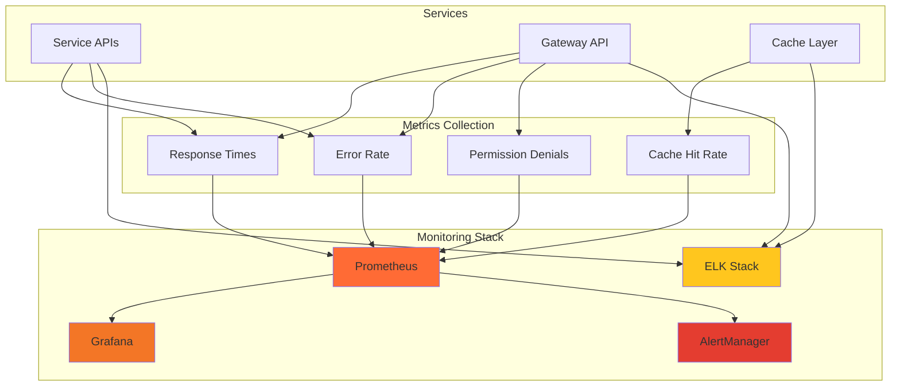
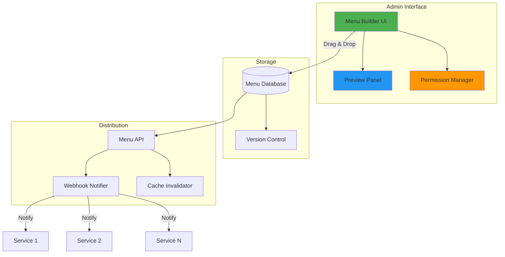

# Menu System Specification

## Overview

This document specifies a distributed menu system for VF Services microservices architecture where individual services (billing, inventory, etc.) can publish menu items that consumer applications (like the website) can aggregate and display.

## System Architecture



## Industry Best Practices Analysis

### Common Approaches in Enterprise Applications

1. **Service Discovery Pattern** (Netflix, Spotify)
   - Services register their capabilities including UI elements
   - Central registry maintains menu contributions
   - Used in large-scale microservices

2. **API Gateway Aggregation** (Amazon, Uber)
   - Gateway aggregates menu items from multiple services
   - Single endpoint for consumers
   - Reduces client-side complexity

3. **Event-Driven Menu Updates** (Slack, Microsoft Teams)
   - Services publish menu changes to event bus
   - Consumers subscribe to menu updates
   - Real-time menu synchronization

4. **Static Configuration with Dynamic Permissions** (Google Workspace, Salesforce)
   - Menu structure defined centrally
   - Permissions checked at runtime
   - Easier to maintain consistent UX

## Recommended Approach for VF Services

Based on the current architecture and scale, we recommend a **Hybrid API-Based Approach with Caching**:

### Why This Approach?

1. **Fits existing architecture** - Aligns with current JWT-based auth and service communication
2. **Performance** - Redis caching prevents repeated API calls
3. **Flexibility** - Services maintain autonomy over their menus
4. **Simplicity** - No additional infrastructure required
5. **Industry-proven** - Similar to Shopify's app extension system

## Architecture Design

### 1. Menu Data Structure

```json
{
  "menu_name": "sidebar_menu",
  "items": [
    {
      "id": "inventory_main",
      "label": "Inventory",
      "url": "/inventory/",
      "icon": "box-icon",
      "order": 100,
      "permissions": ["inventory.view_product"],
      "app_name": "inventory",
      "children": [
        {
          "id": "inventory_products",
          "label": "Products",
          "url": "/inventory/products/",
          "permissions": ["inventory.view_product"]
        }
      ]
    }
  ]
}
```

### Menu Flow Sequence



### 2. Service-Side Implementation

Each service implements:

#### Menu Manifest (`menu_manifest.py`)
```python
MENU_CONTRIBUTIONS = {
    'sidebar_menu': {
        'items': [
            {
                'id': 'inventory_main',
                'label': 'Inventory',
                'url': '/inventory/',
                'icon': 'box-icon',
                'order': 100,
                'permissions': ['inventory.view_product'],
                'children': [...]
            }
        ]
    },
    'top_menu': {
        'items': [...]
    }
}
```

#### Menu API Endpoint
```
GET /api/menus/{menu_name}/
Authorization: Bearer <JWT_TOKEN>

Response:
{
  "menu_name": "sidebar_menu",
  "items": [...],  // Filtered based on user permissions
  "app_name": "inventory",
  "version": "1.0"
}
```

### 3. Consumer-Side Implementation

#### Menu Service (`website/services/menu_service.py`)
```python
class MenuService:
    def __init__(self):
        self.cache = redis_client
        self.service_urls = {
            'inventory': settings.INVENTORY_API_URL,
            'billing': settings.BILLING_API_URL
        }
    
    def get_menu(self, menu_name, user_token):
        # Check cache first
        # Aggregate from multiple services
        # Filter based on permissions
        # Cache results
        return aggregated_menu
```

#### Template Tag Implementation
```python
@register.simple_tag(takes_context=True)
def get_menu(context, menu_name):
    request = context['request']
    menu_service = MenuService()
    return menu_service.get_menu(menu_name, request.user_token)
```

#### Template Usage
```django



<nav class="sidebar">
  
    <div class="menu-item">
      <a href="{{ item.url }}">
        <i class="{{ item.icon }}"></i>
        {{ item.label }}
      </a>
      
        <ul class="submenu">
          
            <li><a href="{{ child.url }}">{{ child.label }}</a></li>
          
        </ul>
      
    </div>
  
</nav>
```

### 4. React/SPA Consumer Implementation

The same API endpoints serve both Django templates and React applications, ensuring consistency across different frontend technologies.

#### Menu API Gateway Endpoint
```
GET /api/gateway/menus/{menu_name}/
Authorization: Bearer <JWT_TOKEN>

Response:
{
  "menu_name": "sidebar_menu",
  "items": [...],  // Aggregated from all services
  "metadata": {
    "version": "1.0",
    "cached_at": "2024-01-17T10:30:00Z",
    "ttl": 300
  }
}
```

#### React Hook Implementation
```javascript
// hooks/useMenu.js
import { useEffect, useState } from 'react';
import { useAuth } from './useAuth';

export const useMenu = (menuName) => {
  const [menu, setMenu] = useState(null);
  const [loading, setLoading] = useState(true);
  const [error, setError] = useState(null);
  const { token } = useAuth();

  useEffect(() => {
    const fetchMenu = async () => {
      try {
        const response = await fetch(`/api/gateway/menus/${menuName}/`, {
          headers: {
            'Authorization': `Bearer ${token}`,
            'Content-Type': 'application/json'
          }
        });
        
        if (!response.ok) throw new Error('Failed to fetch menu');
        
        const data = await response.json();
        setMenu(data);
      } catch (err) {
        setError(err.message);
      } finally {
        setLoading(false);
      }
    };

    if (token) {
      fetchMenu();
    }
  }, [menuName, token]);

  return { menu, loading, error };
};
```

#### React Component Implementation
```javascript
// components/Sidebar.jsx
import React from 'react';
import { useMenu } from '../hooks/useMenu';
import MenuItem from './MenuItem';

const Sidebar = () => {
  const { menu, loading, error } = useMenu('sidebar_menu');

  if (loading) return <div>Loading menu...</div>;
  if (error) return <div>Error loading menu</div>;
  if (!menu) return null;

  return (
    <nav className="sidebar">
      {menu.items.map(item => (
        <MenuItem key={item.id} item={item} />
      ))}
    </nav>
  );
};

// components/MenuItem.jsx
const MenuItem = ({ item }) => {
  const [expanded, setExpanded] = useState(false);

  return (
    <div className="menu-item">
      <a href={item.url} onClick={(e) => {
        if (item.children?.length) {
          e.preventDefault();
          setExpanded(!expanded);
        }
      }}>
        <i className={item.icon}></i>
        {item.label}
      </a>
      {item.children && expanded && (
        <ul className="submenu">
          {item.children.map(child => (
            <MenuItem key={child.id} item={child} />
          ))}
        </ul>
      )}
    </div>
  );
};
```

#### State Management (Redux/Zustand)
```javascript
// store/menuSlice.js
import { createSlice, createAsyncThunk } from '@reduxjs/toolkit';

export const fetchMenu = createAsyncThunk(
  'menu/fetch',
  async ({ menuName, token }) => {
    const response = await fetch(`/api/gateway/menus/${menuName}/`, {
      headers: { 'Authorization': `Bearer ${token}` }
    });
    return response.json();
  }
);

const menuSlice = createSlice({
  name: 'menu',
  initialState: {
    menus: {},
    loading: false,
    error: null
  },
  reducers: {
    clearMenuCache: (state) => {
      state.menus = {};
    }
  },
  extraReducers: (builder) => {
    builder
      .addCase(fetchMenu.pending, (state) => {
        state.loading = true;
      })
      .addCase(fetchMenu.fulfilled, (state, action) => {
        state.loading = false;
        state.menus[action.meta.arg.menuName] = action.payload;
      })
      .addCase(fetchMenu.rejected, (state, action) => {
        state.loading = false;
        state.error = action.error.message;
      });
  }
});
```

#### Next.js Server Components
```typescript
// app/components/ServerSidebar.tsx
import { headers } from 'next/headers';

async function getMenu(menuName: string) {
  const headersList = headers();
  const token = headersList.get('authorization');
  
  const response = await fetch(`${process.env.API_GATEWAY_URL}/menus/${menuName}/`, {
    headers: { 'Authorization': token },
    next: { revalidate: 300 } // 5 minute cache
  });
  
  if (!response.ok) return null;
  return response.json();
}

export default async function ServerSidebar() {
  const menu = await getMenu('sidebar_menu');
  
  if (!menu) return null;
  
  return (
    <nav className="sidebar">
      {menu.items.map((item) => (
        <MenuItemServer key={item.id} item={item} />
      ))}
    </nav>
  );
}
```

### 5. API Gateway for Frontend Applications

To better serve React/SPA applications, implement an API gateway pattern:

```python
# website/api/views.py
from django.views.decorators.cache import cache_page
from django.utils.decorators import method_decorator

@method_decorator(cache_page(60 * 5), name='dispatch')  # 5 min cache
class MenuGatewayView(APIView):
    def get(self, request, menu_name):
        menu_service = MenuService()
        
        # Get user token from request
        token = request.META.get('HTTP_AUTHORIZATION', '').replace('Bearer ', '')
        
        # Aggregate menus from all services
        aggregated_menu = menu_service.get_aggregated_menu(menu_name, token)
        
        # Add CORS headers for SPA
        response = JsonResponse(aggregated_menu)
        response['Access-Control-Allow-Origin'] = settings.ALLOWED_ORIGINS
        response['Access-Control-Allow-Headers'] = 'Authorization, Content-Type'
        
        return response
```

### 6. WebSocket Support for Real-time Updates

For dynamic menu updates without page refresh:

```javascript
// React WebSocket implementation
const useMenuWebSocket = (menuName) => {
  const [menu, setMenu] = useState(null);
  const { token } = useAuth();

  useEffect(() => {
    const ws = new WebSocket(`wss://api.example.com/ws/menus/`);
    
    ws.onopen = () => {
      ws.send(JSON.stringify({
        type: 'subscribe',
        menu: menuName,
        token: token
      }));
    };
    
    ws.onmessage = (event) => {
      const data = JSON.parse(event.data);
      if (data.type === 'menu_update' && data.menu_name === menuName) {
        setMenu(data.menu);
      }
    };
    
    return () => ws.close();
  }, [menuName, token]);
  
  return menu;
};
```

### 7. Migration Strategy: Django to React



### 8. Performance Optimizations for SPAs

1. **Bundle Optimization**
   ```javascript
   // Lazy load menu components
   const Sidebar = lazy(() => import('./components/Sidebar'));
   ```

2. **Service Worker Caching**
   ```javascript
   // Cache menu responses
   self.addEventListener('fetch', (event) => {
     if (event.request.url.includes('/api/gateway/menus/')) {
       event.respondWith(
         caches.match(event.request).then(response => {
           return response || fetch(event.request);
         })
       );
     }
   });
   ```

3. **GraphQL Alternative**
   ```graphql
   query GetMenu($menuName: String!, $locale: String) {
     menu(name: $menuName, locale: $locale) {
       items {
         id
         label
         url
         icon
         permissions
         children {
           id
           label
           url
         }
       }
     }
   }
   ```

## Implementation Phases



### Phase 1: Basic Implementation (MVP)
1. Create menu manifest in inventory service
2. Implement menu API endpoint
3. Create template tag in website
4. Basic permission filtering

### Phase 2: Performance Optimization
1. Add Redis caching
2. Implement cache invalidation
3. Add menu versioning

### Phase 3: Advanced Features
1. Dynamic menu updates via WebSocket
2. Menu personalization
3. A/B testing support
4. Analytics integration

## Security Considerations



1. **Permission Validation**
   - Always validate permissions server-side
   - Never trust client-side permission checks
   - Use JWT claims for permission verification

2. **URL Security**
   - Validate all URLs to prevent injection
   - Use relative URLs where possible
   - Sanitize user-provided content

3. **Cache Security**
   - Include user ID in cache keys
   - Set appropriate TTL values
   - Clear cache on permission changes

## Performance Considerations

1. **Caching Strategy**
   - Cache menus per user (includes permissions)
   - TTL: 5 minutes (configurable)
   - Invalidate on user permission changes

2. **API Optimization**
   - Parallel API calls to services
   - Timeout handling (2 seconds per service)
   - Graceful degradation if service unavailable

3. **Frontend Optimization**
   - Lazy load submenus
   - Progressive enhancement
   - Local storage for static menu structure

## Configuration

### Environment Variables
```bash
# Website settings
MENU_CACHE_TTL=300  # 5 minutes
MENU_API_TIMEOUT=2  # seconds
MENU_AGGREGATION_ENABLED=true

# Service URLs
INVENTORY_API_URL=http://inventory-api:8000
BILLING_API_URL=http://billing-api:8000
```

### Django Settings
```python
MENU_CONFIG = {
    'CACHE_TTL': int(os.getenv('MENU_CACHE_TTL', 300)),
    'API_TIMEOUT': int(os.getenv('MENU_API_TIMEOUT', 2)),
    'AGGREGATION_ENABLED': os.getenv('MENU_AGGREGATION_ENABLED', 'true') == 'true',
    'SERVICE_URLS': {
        'inventory': os.getenv('INVENTORY_API_URL'),
        'billing': os.getenv('BILLING_API_URL'),
    }
}
```

## Testing Strategy

1. **Unit Tests**
   - Menu manifest validation
   - Permission filtering logic
   - Cache operations

2. **Integration Tests**
   - Service-to-service menu fetching
   - Aggregation logic
   - Error handling

3. **E2E Tests**
   - Menu rendering in browser
   - Permission-based visibility
   - Performance benchmarks

## Monitoring and Observability

### Monitoring Architecture



1. **Metrics to Track**
   - Menu API response times
   - Cache hit/miss rates
   - Aggregation failures
   - Menu render times

2. **Logging**
   - API requests/responses
   - Permission denials
   - Cache operations
   - Error conditions

## Migration Plan

1. **Rollout Strategy**
   - Start with inventory service
   - Test with subset of users
   - Gradually add more services
   - Full production rollout

2. **Rollback Plan**
   - Feature flag for menu system
   - Fallback to static menus
   - Cache clear procedure

## Future Enhancements

### Menu Builder UI Concept



1. **Menu Builder UI**
   - Admin interface for menu management
   - Drag-and-drop menu organization
   - Preview functionality

2. **Advanced Permissions**
   - Feature flags integration
   - Role-based menu variations
   - Time-based menu items

3. **Analytics Integration**
   - Click tracking
   - User journey analysis
   - Menu optimization insights

## Conclusion

This menu system provides a scalable, maintainable solution for distributed menu management in a microservices architecture. The hybrid approach balances performance, flexibility, and simplicity while following industry best practices.