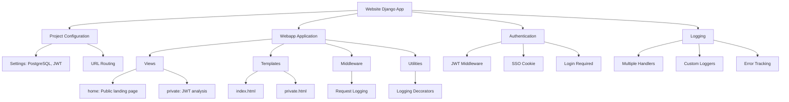

# Website Django App Structure

This directory contains the Django application for the website component of the vfservices project.

## Overview

The website Django app is structured as follows:

## Components

### Project Configuration (`main/`)

- **Settings**: Configure PostgreSQL database, JWT authentication, and other project settings
- **URL Routing**: Routes requests to the webapp views

### Webapp Application (`webapp/`)

- **Views**:
  - `home()`: Public landing page that renders `index.html`
  - `private()`: Authenticated endpoint for JWT analysis that renders `private.html`

- **Templates**:
  - `index.html`: Main landing page template
  - `private.html`: Template for displaying JWT user information and request details

- **Middleware**:
  - Custom request logging middleware

- **Utilities**:
  - Custom logging decorators and utilities

### Authentication

- Uses JWT middleware from the common package
- SSO cookie configuration
- `@login_required` decorator for protected views

### Logging

- Comprehensive logging configuration with multiple handlers
- Custom loggers for different components
- Error tracking and request logging

## Key Observations

1. The app is primarily focused on authentication analysis and request handling
2. No database models are currently defined
3. Comprehensive logging is implemented throughout
4. JWT authentication is handled through shared middleware
5. The app has two main views/templates

## Files

- `Dockerfile`: Docker configuration for the website service
- `entrypoint.sh`: Entry point script for Docker
- `manage.py`: Django project management script
- `main/`: Project configuration directory
- `webapp/`: Application directory with views, templates, and utilities
